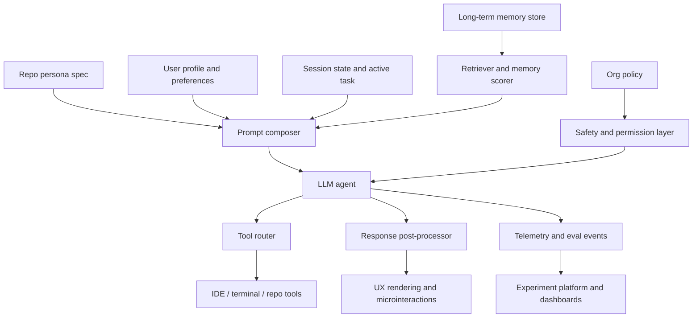
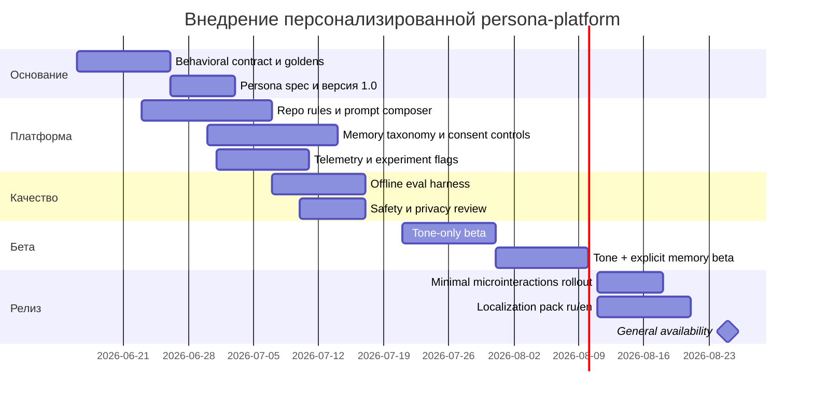

# Персонализация Cloud Code и агентной кодовой среды

iturn30image4turn31image9turn32image6turn33image10

## Executive summary

Персонализация агентной кодовой среды в 2026 году уже стала стандартной практикой, но индустрия в основном реализует ее не через «магическую личность», а через несколько четких слоев: репозиторные инструкции, пользовательские предпочтения, долгую память, task-specific prompts, правила доступа к инструментам и организационные policy-файлы. Это видно по GitHub Copilot с личными и репозиторными инструкциями, по Cursor с `.cursor/rules` и `AGENTS.md`, по Claude Code с `CLAUDE.md`, `.claude/rules/`, auto memory и subagents, по Windsurf с Memories & Rules, по Continue с `.continue/rules` и `config.yaml`, а также по Gemini CLI с иерархией `GEMINI.md`. Иными словами, «душа» у современного coding agent обычно рождается не из одного system prompt, а из управляемой конфигурационной системы. citeturn3search0turn3search1turn1search1turn4search4turn7search0turn8search1turn6search0

Если цель — повысить вовлеченность и субъективное «хочется с этим работать», то самый надежный путь — не усиливать антропоморфность ради антропоморфности, а проектировать опыт вокруг четырех ощущений: компетентность, предсказуемость, узнавание пользователя и приятная микро-обратная связь. Исследования по CASA и relational agents показывают, что люди автоматически применяют социальные ожидания к цифровым системам, а память, постепенное самораскрытие и повторяемые ритуалы действительно усиливают ощущение отношений с агентом. Но та же литература и регуляторные материалы по deceptive design показывают, что эта граница тонкая: приемы, повышающие «липкость», очень легко превращаются в dark patterns, давление, скрытое steering или этически сомнительное подкручивание поведения. citeturn16search1turn16search3turn17search2turn17search3turn17academia56turn20search0turn20search1turn20search2turn21search2

Практический вывод для mid-sized engineering team такой: сначала строить надежную, версионируемую persona platform как часть codebase governance, а уже сверху — легкую «личность». Лучшие команды не делают agent «харизматичным» прежде, чем у него появятся хорошие repo rules, короткий feedback loop, прозрачная память, понятные права на инструменты, evals, rollback и аналитика. Это хорошо согласуется и с производственными практиками AI coding tools, и с выводами DORA: ИИ обычно усиливает уже существующие сильные или слабые стороны вашей инженерной системы, а не компенсирует их. citeturn4search0turn8search0turn24search0turn24search4turn15search3turn15search10turn28search2

Ниже — строгая модель внедрения: что именно персонализировать, какие техники использовать, чего избегать, как это тестировать, какие метрики снимать, а также конкретный план запуска на 12 недель, пример persona spec, набор конфигов и образцы prompt/config/code. Все рекомендации опираются на официальный tooling и первичные публикации, а там, где даются проектные оценки effort/risk, это явно отмечено как инженерная оценка, а не эмпирический факт. citeturn3search8turn4search4turn7search0turn8search6turn10search3turn13search0turn11search0turn14search0

## Допущения и постановка задачи

Я интерпретирую ваш термин **Cloud Code** не как конкретный legacy-продукт Google Cloud Code, а как более широкий класс: облачный или гибридный кодовый агент, который работает поверх codebase, IDE или terminal workflow и при этом имеет настраиваемую persona / style layer / memory layer. Это допущение необходимо, потому что в запросе не указан конкретный vendor или runtime. Также предполагаю, что вы проектируете опыт **для разработчиков**, а не для конечных потребителей, что техстек не фиксирован, а приватность и compliance важны как минимум на уровне typical enterprise baseline: opt-in memory, delete/export controls, auditability и запрет на «скрытую» персонализацию без согласия. citeturn5search1turn5search4turn4search0turn21search2

Под «душой» или personality в этой задаче полезно понимать не романтическую метафору, а инженерно управляемый набор свойств: устойчивый тон, поведенческие ритуалы, узнавание контекста пользователя, работающая память, характерный формат обратной связи, ясные ценности и стиль помощи. На практике это раскладывается на слой **инструкций**, слой **состояния**, слой **UX-сигналов** и слой **измерений**. Персонализация без состояния быстро выглядит как cosplay; состояние без UX-паттернов ощущается как сухой RAG; UX без guardrails и consent превращается в манипуляцию. citeturn4search4turn10search3turn26search1turn19search0turn20search1

Ниже я буду различать три уровня цели: **полезность** — агент реально помогает быстрее и качественнее; **привязанность** — с ним приятнее работать и хочется возвращаться; **благополучие** — опыт не повышает перегрузку, фрустрацию и ощущение, что системой манипулируют. Именно третья цель чаще всего отсутствует в продуктовых внедрениях, хотя официальные HCI и комфортные design guidelines прямо предупреждают против чрезмерной анимации, ненужного interruption и неясной обратной связи. citeturn19search0turn19search1turn14search0turn11search0

### Что именно персонализировать

| Слой | Что хранится | Горизонт жизни | Где обычно живет | Зачем нужен |
|---|---|---:|---|---|
| Policy layer | безопасность, compliance, tool permissions, запреты | долгий | org/system config, managed settings | чтобы personality не обходила правила |
| Project layer | архитектура, convensions, workflow, code style | долгий | repo files: `CLAUDE.md`, `.cursor/rules`, `.github/copilot-instructions.md`, `.continue/rules`, `GEMINI.md` | чтобы агент говорил «на языке проекта» |
| User layer | язык, тон, глубина объяснений, любимые команды | долгий | user/global instructions | чтобы агент говорил «на языке разработчика» |
| Session layer | текущая цель, branch, active files, feedback during task | короткий | thread state/checkpoint | чтобы агент был контекстным «здесь и сейчас» |
| Long-term memory | устойчивые предпочтения, уроки, recurring pain points | средний/долгий | auto memory, store, memory blocks | чтобы персонализация не сбрасывалась |
| UX layer | микротексты, confirmations, celebratory cues, surprise budget | короткий | UI/assistant responses | чтобы продукт ощущался живым |
| Measurement layer | evals, telemetry, experiment flags, wellbeing metrics | непрерывно | analytics + experimentation stack | чтобы не делать «душу» на ощущениях |

Эта декомпозиция хорошо совпадает с тем, как это уже реализуют Anthropic, GitHub, Cursor, Windsurf, Continue, LangGraph и Letta: инструкции, память, инструменты и управление состоянием у них разделены на разные сущности, а не смешаны в один промпт-файл. citeturn4search0turn3search0turn1search1turn7search0turn8search7turn10search0turn26search1

## Практики индустрии

Главная индустриальная тенденция — **personality as configuration, not as prose**. То есть почти все зрелые инструменты уходят от идеи «напишите длинный system prompt» и переходят к иерархии файлов, путевым правилам, memory stores, subagents и prompt libraries. Для инженерной команды это критично: такой подход можно code-review’ить, версионировать, откатывать, локализовать и прогонять через CI. citeturn1search1turn4search4turn3search0turn8search1turn6search0

### Сравнение текущих подходов

| Инструмент | Как задается persona / tone | Как задается проектный контекст | Память | Что особенно важно для вашей задачи | Источник |
|---|---|---|---|---|---|
| **GitHub Copilot** | personal custom instructions | `.github/copilot-instructions.md`, path-specific `.instructions.md`, prompt files, `AGENTS.md` precedence | персональные инструкции; repo-level context; ссылки на инструкции в references | хороший паттерн для repo-governed personality и path-scoped behavior | citeturn3search0turn3search4turn3search7turn3search8 |
| **Cursor** | User Rules | `.cursor/rules`, `AGENTS.md`, scoped rules via globs | правила как prompt-level persistent context | сильный опыт для файловой/директорной сегментации поведения | citeturn1search1 |
| **Claude Code** | user/global `CLAUDE.md`, output styles, subagents | `CLAUDE.md`, `.claude/rules/`, imports, organization-managed files | auto memory + project/user memory + agent memory | лучший референс для layered memory и subagent-specific personality | citeturn4search4turn4search0turn2view0 |
| **Windsurf / Cascade** | global/workspace/system rules | `.windsurf/rules` discovered across workspace and git root | auto-generated memories + rules | хороший референс для auto memory + enterprise system rules + analytics/gamification | citeturn7search0turn7search5turn7search7turn32image0 |
| **Continue** | custom system messages, prompts | `.continue/rules`, `config.yaml`, prompt files, hub rules | контекст через rules/prompts/tools; config-as-data | лучший open-source baseline для customizable agent stack | citeturn8search0turn8search1turn8search2turn8search6turn8search7 |
| **Gemini CLI** | global/workspace/JIT `GEMINI.md` | иерархия `GEMINI.md`, imports, custom filename | show/reload through `/memory`; conversation checkpointing | важен как быстрорастущий open-source паттерн «context file hierarchy» | citeturn6search0turn6search1turn6search4turn6search6 |
| **Cline** | `.clinerules` custom instructions | memory bank files + rules + skills | structured memory bank across sessions | сильный паттерн «документация как память» | citeturn9search1turn9search3turn9search7 |
| **Letta / MemGPT / LangGraph** | persona blocks / runtime context | configurable agent settings / state graph | explicit memory blocks, stores, checkpoints, archival memory | лучший reference architecture для собственной memory platform | citeturn26search1turn26academia46turn10search0turn10search3turn9search0 |

### Что реально делают лидирующие продукты

**Репозиторные инструкции как codebase contract.** GitHub Copilot позволяет накладывать личные, репозиторные, path-specific и organization-level instructions, при этом личные инструкции имеют наивысший приоритет, а repo-файлы автоматически добавляются в запросы. Cursor и Claude Code делают то же самое, но еще сильнее привязывают поведение к структуре проекта: scoped rules, imports, subdirectory-specific rules, `AGENTS.md`/`CLAUDE.md`. Это показывает важный рыночный консенсус: personality, если она влияет на код, должна быть repo-addressable и audited в git, а не спрятана в UI. citeturn3search0turn3search7turn1search1turn2view0

**Memory как отдельный продуктовый слой.** Claude Code официально разделяет `CLAUDE.md` и auto memory; Windsurf — Rules и auto-generated Memories; ChatGPT — Custom Instructions и Memory; Gemini CLI — `GEMINI.md` hierarchy и `/memory`; Letta и LangGraph — short-term state versus cross-thread long-term memory store. Это особенно важно для «души»: характер не должен храниться в volatile chat history. Устойчивость personality возникает, когда есть явное место для долгоживущих предпочтений и явный способ редактировать или отключать их. citeturn4search4turn7search0turn5search1turn5search7turn6search0turn26search1turn10search3

**Task-specific prompt libraries и reusable skills.** GitHub продвигает prompt files; Continue — markdown prompt files и slash prompts; Claude Code — skills/commands/output styles; Gemini CLI — custom commands alongside `GEMINI.md`. Это структура для controlled surprise: агент может иметь узнаваемые workflow-ритуалы и тон не во всех ответах, а только в контексте подходящих задач. Такой selective loading обычно лучше, чем глобальная «эксцентричная» persona. citeturn3search8turn8search2turn8search9turn4search0turn6search4

**Аналитика и achievement-слой уже заходят в dev tools.** Windsurf в своих docs показывает usage/analytics, completion stats и achievement badges. Это прямой сигнал, что рынок уже экспериментирует не только с качеством кода, но и с behavioral engagement loops внутри developer tooling. Делать это можно, но именно тут начинается зона риска: метрики и бейджи легко скатываются в productivity theater или темные паттерны. citeturn32image0turn20search1turn20search2

### Кейсы, которые стоит копировать частично, а не полностью

**Claude Code** — сильнейший кейс для иерархии памяти. У него есть project/user/org-level instruction files, `.claude/rules`, auto memory, subagent memory, hooks и отдельные output styles. Но docs прямо предупреждают, что instructions — это контекст, а не жесткая конфигурация; если нужен hard control, используйте hooks. Это правильная инженерная философия: personality должна быть мягкой, а safety/policy — жесткими. При этом docs также указывают, что транскрипты и история хранятся в plain text и не шифруются at rest, если не обеспечить внешние механизмы защиты. Это ключевое предупреждение для любой долгой памяти в агенте. citeturn2view0turn4search0

**GitHub Copilot** — сильный кейс для organizational alignment. Он поддерживает инструкции на уровнях person/repo/org, path-specific files и reusable prompt files; repo instructions можно видеть в references конкретного ответа. Это хороший паттерн прозрачности: если personality или style влияли на ответ, разработчик должен иметь шанс увидеть источник. citeturn3search0turn3search7turn30image4

**Continue** — сильный open-source кейс для system messages as data. У него rules, prompts, tools и model roles сведены в config-based architecture, а system messages для chat/agent/plan можно задавать на уровне конфигурации. Для mid-sized team это, вероятно, лучший эталон, если вы хотите собрать свою реализацию без vendor lock-in. citeturn8search0turn8search6turn8search7

**Replika** — полезный, но опасный референс. Официально продукт строится как AI companion, который запоминает имя, вкусы, отношения и развивает personalization по мере взаимодействия; при этом память можно просматривать и удалять. Это показывает, как memory и relationship framing действительно создают эмоциональную привязанность. Но именно companion-формат требует очень жестких этических ограничений в dev tooling: кодовый агент не должен подменять собой социальную привязанность или давить на чувство долга перед инструментом. citeturn29search0turn29search1turn29search2turn20search0

## UX-психология и границы

Основа всей этой темы — старый, но до сих пор валидный результат HCI: люди автоматически и «безмысленно» применяют социальные правила к компьютерам. Исследования Nass и Moon, а также более ранний тезис Computers Are Social Actors, показывают, что человек склонен интерпретировать интерфейс как социального партнера, даже если сознательно понимает, что это машина. Следствие простое: достаточно немного последовательного тона, memory cues и ритуалов — и инструмент начинает ощущаться как «кто-то», а не как stateless autocomplete. citeturn16search1turn16search3

Дальше вступает литература по relational agents. Bickmore и Picard показывали, что для долгих взаимодействий особенно важны повторяемость контактов, память о прошлом, subtle expressivity и социальные механики, поддерживающие отношения во времени; позднейшая работа Bickmore и коллег отдельно разбирает, как удерживать engagement в long-term interventions. Для coding agent это переводится в вещи намного более приземленные: постоянный стиль feedback, узнавание ваших привычек, осторожное «помню, что вы обычно предпочитаете X», ясное завершение шагов и ощущение прогресса без лишней драматизации. citeturn17search2turn17search3turn17search0

Отдельно важна **взаимность**. Исследования по chatbot self-disclosure показывают, что, когда бот умеренно и адаптивно раскрывает «себя» — например, объясняет свою стратегию, признает ограничения, кратко формулирует мотив ответа, — пользователи чаще отвечают более вовлеченно, получают больше enjoyment и выше оценивают взаимодействие. Но адаптивность критична: избыточная familiarity или слишком ранняя «интимность» может восприниматься как intrusive. Для developer tool это значит: backstory должна быть очень тонкой и служебной. Пример хорошей self-disclosure — «я руководствовался правилами проекта и не стал трогать legacy-папку»; пример плохой — «я так рад снова работать с тобой». citeturn17academia56turn17academia57turn17academia54

Память усиливает **правдоподобие личности**, но дает бонус только если она полезна и точна. Generative Agents и современные memory architectures сходятся в одном: запоминание, рефлексия и выборочный retrieval повышают believability и continuity, однако плохая память быстро разрушает доверие. В dev environment неправильно извлеченная preference memory опаснее, чем отсутствие memory: ошибочный «ты любишь X» быстро ощущается как подделка или галлюцинация. Поэтому память нужно делить на уровни достоверности: explicit user-set preferences, model-inferred preferences, stale hypotheses. citeturn27academia32turn26academia46turn26search1turn10search3

Теперь о «дофамине». Научно корректно говорить не «мы повышаем дофамин», а «мы проектируем сигналы reward anticipation, competence feedback и novelty». Работы Schultz по reward prediction error показывают, что дофаминовый сигнал тесно связан не с простым получением награды, а с различием между ожидаемой и фактической наградой. Для UX это означает, что полезнее не постоянный сахар, а редкие, уместные, честные positive surprises: неожиданный, но точный refactor suggestion; аккуратная автоподстановка нужной команды; мгновенное понимание repo conventions без дополнительного промпта. При этом variable reward schedules действительно могут удерживать поведение, но в consumer policy именно такие механики часто попадают в зону манипуляции и dark patterns. citeturn18search0turn18search2turn20search1turn20search2

Микровзаимодействия должны быть краткими, purpose-driven и доступными. Apple HIG и Material Design сходятся: feedback помогает понять статус, результаты действия и следующие шаги; motion должна быть короткой, точной и не повторяться навязчиво на частых действиях; анимация не должна быть единственным каналом смысла. Для coding agent это означает: короткие confirmations, аккуратные step markers, нечастые celebratory cues, отсутствие «шоу» на каждой выдаче кода. Personality ощущается сильнее именно тогда, когда она не мешает работе. citeturn19search0turn19search1turn19search2

### Что использовать и чего избегать

| Техника | Когда работает | Когда вредна | Практическое правило |
|---|---|---|---|
| Узнаваемый тон | повышает предсказуемость и trust calibration | если тон приоритетнее точности | tone никогда не должен менять содержательные решения |
| Легкий backstory | помогает объяснить стиль помощи | если агент антропоморфизируется слишком сильно | backstory только функциональный, без fake-emotion |
| Память о предпочтениях | экономит повторные инструкции | если память неточна или скрыта | explicit > inferred, edit/delete must be easy |
| Reciprocity / self-disclosure | повышает чувство сотрудничества | если выглядит как emotional bait | раскрывать не «чувства», а reasoning/context |
| Surprise | усиливает delight и ощущение competence | если превращается в random gamification | surprise budget ограниченный и task-relevant |
| Reward badges / streaks | может поддержать adoption | провоцирует compulsive use и vanity behavior | не завязывать на длительность сессии, только на реальные outcomes |
| Microinteractions | делают продукт «живым» | если добавляют шум и interrupt cost | максимум информации за минимум времени |

Эти границы хорошо согласуются и с академической литературой по антропоморфизму/отношениям, и с официальными документами по deceptive patterns, explicability и trustworthy AI. citeturn16search1turn17search2turn17academia56turn20search0turn20search2turn21search1turn21search2

## Техническая архитектура и варианты реализации

Наилучшая архитектура для «personalized but safe» coding agent — это **слоеная система**, где persona не смешана с policy и не привязана к одному вендору. Ниже — референсная схема, которую можно реализовать поверх любого стека. Она напрямую перекликается с тем, как официальные продукты разделяют rules, memory, tools, state и evals. citeturn4search0turn8search7turn10search0turn26search1turn24search0



### Базовые паттерны реализации

**Persona spec как отдельный артефакт.** Не храните personality только в prose-файле. Нужен нормализованный spec с полями tone, verbosity, values, guardrails, ritual cues, memory schema, localization bindings и experiment hooks. Тогда persona можно lint’ить, diff’ить, переводить и сравнивать по версиям. Это логически соответствует structured agent settings у OpenHands, memory blocks у Letta и YAML/config-first подходу Continue. citeturn9search0turn26search1turn8search7

**Разделяйте short-term state и long-term memory.** LangGraph прямо различает thread-scoped state через checkpointer и cross-thread memory через Store; Letta разделяет always-visible memory blocks и external memory. Это хорошая модель и для coding agent: branch context, active files и текущая цель — это thread state; любимый язык ответа, предпочитаемый формат diff review и типичные команды — long-term preferences. citeturn10search0turn10search3turn26search1turn26search2

**Inferred memory должна быть слабее explicit memory.** В OpenAI Memory и Replika память частично строится автоматически, но пользователю оставляют просмотр/редактирование/удаление. Для developer tool это минимальный baseline: любое inferred preference должно быть explainable и редактируемым, а для чувствительных сред — по умолчанию либо выключенным, либо opt-in. citeturn5search1turn5search4turn29search0turn29search1

**Сначала правила и permissions, потом «характер».** Continue и Claude Code оба позволяют управлять system messages/tool policies отдельно; Claude дополнительно предлагает hooks для hard enforcement. Это означает, что persona-поведение в prompt composer должно формироваться *после* policy-фильтров и *до* final UX formatting, но не должно иметь права менять tool permissions или safety thresholds. citeturn8search6turn2view0

### Рекомендуемая иерархия файлов

| Уровень | Содержимое | Коммитить? | Рекомендуемый формат | Комментарий |
|---|---|---:|---|---|
| Org / managed | safety, secret handling, compliance, approved tools | обычно нет в repo, да в admin config | JSON/YAML/managed settings | «конституция» |
| Repo | persona, style, architecture, workflows | да | `AGENTS.md`, `CLAUDE.md`, `.github/copilot-instructions.md`, `.continue/rules/*`, `.cursor/rules/*`, `GEMINI.md` | командная норма |
| Path-scoped | модульные правила, tech-specific style guides | да | `.instructions.md`, `.mdc`, scoped rules | снижает prompt bloat |
| User | language, verbosity, local shortcuts | нет | user profile / global rules | персональный слой |
| Memory | stable prefs, lessons learned, summarized history | нет или выборочно | memory DB / markdown / KV + embeddings | нужен TTL, provenance и delete |
| Experiment | feature flags, arm assignment, evaluation version | нет | flags + telemetry schemas | нужен для A/B и rollback |

Такая структура повторяет паттерны GitHub, Cursor, Claude Code, Windsurf, Continue и Gemini CLI. citeturn3search0turn1search1turn4search4turn7search0turn8search1turn6search0

### Пример persona spec

```yaml
version: 1.2.0
id: soulforge.dev.assistant
name: Forge
purpose: >
  Надежный инженерный напарник для работы с кодом, который
  приоритетно повышает ясность, скорость понимания и качество решений.
tone:
  language_default: ru
  style: concise-warm
  humor: low
  directness: high
  verbosity_default: medium
behavior:
  explain_before_action: true
  ask_before_wide_refactor: true
  cite_project_rules_when_relevant: true
  admit_uncertainty: always
  avoid_fake_emotions: true
memory:
  explicit_preferences:
    - preferred_language
    - explanation_depth
    - favorite_commands
    - review_style
  inferred_preferences:
    enabled: true
    confidence_threshold: 0.82
    ttl_days: 30
    user_review_required_for_promotion: true
  sensitive_categories_blocked:
    - secrets
    - credentials
    - health_data
    - personal_relationships
rituals:
  startup:
    - summarize_relevant_rules
    - mention current branch if available
  completion:
    - concise outcome summary
    - next safest step
microinteractions:
  success_cues: subtle
  celebration_budget_per_day: 3
  streaks_enabled: false
guardrails:
  never_override_policy: true
  never_claim_memory_if_not_used: true
  never_infer_user_identity_traits: true
localization:
  supported:
    - ru
    - en
  fallback: en
telemetry:
  emit:
    - task_started
    - memory_used
    - memory_saved
    - user_overrode_suggestion
    - session_satisfaction_prompted
```

Этот шаблон deliberately отделяет tone, rituals, memory и guardrails, потому что именно такая декомпозиция лучше всего переживает локализацию, A/B и red-teaming. citeturn23search0turn23search1turn24search0turn21search2

### Примеры конфигов

#### Репозиторный файл для GitHub Copilot

```md
<!-- .github/copilot-instructions.md -->

# Repo Identity

You are the coding assistant for a production codebase with strict review culture.
Prefer clarity, small diffs, and explicit trade-offs.

# Behavioral Rules

- Respond in the user's preferred language when known.
- Before changing more than 3 files, propose a plan first.
- When uncertain, say exactly what is uncertain.
- Do not add decorative comments or motivational filler.
- Prefer code examples that match existing repository patterns.

# Style of Collaboration

- Sound calm, competent, and slightly opinionated.
- Celebrate only meaningful milestones, never every successful command.
- If memory was used, mention it in one short sentence.
- Never imitate emotions or claim personal feelings.

# Quality Gates

- Run or suggest the narrowest relevant test first.
- Preserve backwards compatibility unless task says otherwise.
- Call out security, migration, and performance risks explicitly.
```

GitHub официально поддерживает такие repo instructions, path-specific instructions и prompt files, а также показывает их в references, если они использовались. citeturn3search0turn3search7

#### Файл для Claude Code

```md
<!-- CLAUDE.md -->

# Project conventions

- Main language for chat replies: Russian, unless user switches language.
- Keep explanations short by default; expand only on request.
- Prefer existing abstractions over fresh framework-y rewrites.
- Always propose before touching more than 3 files.
- For risky changes under src/payments/, use Plan Mode first.

# Personality

- Tone: direct, calm, technically rigorous.
- Do not use fake empathy.
- Use light humor rarely and only after successful milestone completion.
- When a rule from this file shapes the answer, mention the rule section briefly.

# Safety

- Never print secrets from .env or shell output.
- If a tool output appears sensitive, summarize instead of echoing.
```

Это укладывается в официальный паттерн `CLAUDE.md` + scoped rules + `/init` + auto memory у Claude Code. citeturn4search4turn2view0

#### Scoped rule для Cursor

```md
---
description: Personality and review style for backend work
globs: ["src/backend/**/*.ts", "services/**/*.ts"]
alwaysApply: false
---

- Be skeptical of hidden complexity.
- Prefer small, reviewable diffs.
- If changing API behavior, include a short compatibility note.
- If a requested change looks underspecified, ask 1 clarifying question first.
- Use a calm, decisive tone. No cheerleading.
```

Cursor официально поддерживает `.cursor/rules` и scoped rule files в MDC. citeturn1search1

#### Continue config

```yaml
# ~/.continue/config.yaml
models:
  - name: GPT-4o
    provider: openai
    model: gpt-4o
    chatOptions:
      baseSystemMessage: >
        You are Forge, a technically rigorous coding assistant.
        Use the user's preferred language when known.
        Be concise, explicit about uncertainty, and avoid fake emotions.

rules:
  - uses: local/backend-style
  - uses: local/collaboration-style

prompts:
  - uses: local/plan-refactor
  - uses: local/review-risk

tools:
  # MCP tools or repo tools here
```

Continue прямо поддерживает model-level system messages, rules, prompts и tools как конфигурируемые сущности. citeturn8search6turn8search7

### Prompt composer и post-processor

Ниже — псевдокод для безопасной сборки контекста и ответа.

```python
def compose_prompt(input, user, repo, session, memory, policy):
    prompt = []
    prompt.append(policy.system_rules)

    prompt.append(repo.persona_spec.render_base_identity())
    prompt.append(repo.path_rules.for_files(session.active_files))
    prompt.append(user.preferences.as_instructions())

    relevant_memories = memory.retrieve(
        user_id=user.id,
        task=input.task_type,
        active_paths=session.active_files,
        threshold=0.82,
        max_items=5
    )
    prompt.append(render_memory_context(relevant_memories))

    prompt.append(render_session_state(session))
    prompt.append(input.message)

    return "\n\n".join(chunk for chunk in prompt if chunk)


def postprocess_response(raw, policy, ux, memory_trace):
    safe = policy.filter_sensitive_echo(raw)
    final = ux.apply_microcopy(safe)

    if memory_trace.used:
        final += "\n\n[context] Использованы сохраненные предпочтения и/или память проекта."

    return final
```

Это соответствует принципу explainability и traceability: если personalization повлияла на ответ, пользователь должен иметь хотя бы минимальную видимость этого факта. citeturn5search4turn21search0turn21search1

### A/B-ready telemetry schema

```json
{
  "event_name": "agent_response_rendered",
  "timestamp": "2026-06-14T12:00:00Z",
  "user_id_hash": "u_9f41...",
  "session_id": "s_18c2...",
  "experiment_arm": "tone_plus_memory_plus_microfeedback",
  "persona_version": "1.2.0",
  "repo_profile": "backend-monolith",
  "memory_used": true,
  "memory_items_count": 3,
  "task_type": "debugging",
  "response_tokens": 612,
  "tool_calls": ["search_code", "run_tests"],
  "user_outcome": {
    "accepted_diff": true,
    "manual_override": false,
    "follow_up_turns": 2
  },
  "counter_metrics": {
    "frustration_signal": false,
    "memory_delete_after_session": false,
    "temporary_mode_selected": false
  }
}
```

Технически это можно снять через обычный observability stack; OpenTelemetry — стандартный vendor-neutral базис для traces/metrics/logs. citeturn11search1turn11search2

## Операционная модель команды

На практике persona-platform нужно вести как продукт и как infra одновременно. Для mid-sized team разумна такая ownership-модель: один **product owner for agent experience**, один **engineering lead/platform engineer**, один **designer or UX writer**, один **security/privacy reviewer**, плюс по одному representative из двух-трех инженерных команд как design partners. Иначе вы либо получите «красивую личность без интеграции», либо «конфиги без пользовательского эффекта». DORA и SPACE-подходы здесь полезны именно потому, что они требуют смотреть на продукт сразу через производительность, удовлетворенность и стабильность, а не только через adoption. citeturn28search1turn15search10turn28search2

### CI/CD и тестирование personality

**Treat prompts as code.** Любой persona diff должен идти через PR, иметь changelog, semantic version и обязательные eval gates. OpenAI Evals, Promptfoo и аналогичные системы хороши не как vendor choice, а как reminder: prompt changes нельзя проверять «на глаз». Минимум — regression set, style assertions, safety assertions, multi-turn replay, persona consistency checks и one-click rollback на прошлую persona version. citeturn24search0turn24search1turn24search2turn24search3

**Нужно тестировать не только endpoint, но и траекторию.** Для coding agent одинаково важны итоговый diff, число ходов до решения, частота ненужных tool calls, неоправданные рефакторы и ошибки в memory retrieval. Классический урок online experimentation: если вы плохо измеряете outcome, A/B превращается в ложную оптимизацию. Работы Kohavi и коллег, а также Microsoft-подходы к trustworthy experimentation, подчеркивают, что experiment validity и quality telemetry — не опция, а основа. citeturn25search0turn11academia50turn11academia53

**Секреты и sensitive captures.** Claude Code docs отдельно предупреждают о plain-text transcripts/history. Это означает очень практичную политику: нельзя без фильтрации засовывать shell ouputs и tool transcripts в долговременную память; prompt artifacts должны проходить secret scanning; долговременная память не должна автоматически промотировать содержимое `.env`, access tokens, incident payloads и персональные данные. citeturn4search0turn21search2

### Версионирование persona

Рекомендую версионировать persona независимо от приложения:

- `persona_version` — semver.
- `behavioral_contract_version` — когда меняется expected behavior.
- `memory_schema_version` — когда меняется формат сохраняемых предпочтений.
- `localization_pack_version` — когда меняется текст/тон по языкам.

Это позволяет делать safe rollbacks и отдельно оценивать, что именно улучшило или ухудшило метрики: сам tone, memory policy или localization pack. Такая дисциплина естественно ложится на уже существующие config-first инструменты вроде Continue/OpenHands/LangGraph. citeturn8search7turn9search0turn10search0

### Локализация и культурная адаптация

Простая машинная калька personality обычно дает плохой результат. Для локализации developer-persona нужен не только перевод, но и **cultural tuning**: степень прямоты, форма обращения, плотность текста, допустимый юмор, формат кратких confirmations и pluralization. ICU MessageFormat, Unicode CLDR и i18next fallback patterns дают правильную инфраструктурную базу: не собирать сообщения конкатенацией, а хранить их как целые localizable units с placeholders, plural forms и regional fallbacks. citeturn23search0turn23search1turn23search2turn22search1

Ниже — разумное правило: **переводить не слова personality, а ее эффекты**. Например, англоязычный «collegial tone» не всегда должен становиться в русском фамильярным «дружелюбным» стилем; часто правильнее — «спокойный, деловой, без канцелярита». Это не просто copy choice, а фактор доверия и fatigue. citeturn21search1turn11search0

## Метрики, эксперименты и дизайн A/B tests

Оценивать такой продукт одной метрикой нельзя. Для developer-facing agent нужен гибрид из HEART, SPACE, delivery-quality и wellbeing measures. HEART полезен как рамка для product UX goals; HaTS — для коротких in-product attitude surveys; SPACE — для инженерного контекста; DORA — для delivery health; SUS/UMUX-Lite — для usability; NASA-TLX — для perceived workload; WHO-5 — для скрининга субъективного благополучия на длинном горизонте. citeturn13search0turn13search1turn28search1turn15search1turn14search0turn12search1turn11search0

### Набор метрик, который действительно стоит снимать

| Категория | Метрика | Почему важна | Источник/рамка |
|---|---|---|---|
| Adoption | weekly active developers, retained users D7/D30 | показывает, вернулись ли к tool после novelty phase | HEART / product analytics citeturn13search0 |
| Utility | task success rate, accepted diffs, time-to-first-useful-diff | измеряет реальную помощь, а не chat volume | SPACE + delivery metrics citeturn28search1turn15search1 |
| Interaction quality | turns-to-resolution, unnecessary tool calls, re-prompt rate | показывает friction и «болтливость» | experimentation practice citeturn25search0turn11academia53 |
| Satisfaction | CSAT after resolved task, in-product HaTS, SUS/UMUX-Lite | разделяет usefulness и «нравится/не нравится» | citeturn13search1turn12search1turn12search0 |
| Cognitive load | NASA-TLX short form after complex tasks | проверяет, не превращает ли personality опыт в лишний шум | citeturn14search0 |
| Wellbeing | WHO-5 pulse, frustration rate, “felt manipulated” item | защищает от dark-patterned engagement | citeturn11search0turn20search1turn20search2 |
| Trust & control | memory opt-out rate, memory delete rate, temp-session usage | если люди боятся personalization, это сразу видно | citeturn5search1turn5search4turn29search0 |
| Safety | sensitive memory write attempts blocked, unsafe echo rate | guardrail health | citeturn21search2turn4search0 |
| Delivery health | CFR, lead time, revert rate, incident mentions tied to AI diffs | personality не должна ухудшать SDLC | citeturn15search1turn15search10 |

### Какие графики должны быть на дашборде

| График | Что показывает |
|---|---|
| Retention by experiment arm | удержание по вариантам personality |
| Turns-to-resolution distribution | стала ли persona помогать решать задачи быстрее |
| Accepted diff rate by task type | где personality помогает, а где мешает |
| Memory usage vs satisfaction | дает ли память реальную ценность |
| Memory delete/opt-out trend | где personalization начинает пугать |
| NASA-TLX and WHO-5 trend | нет ли роста нагрузки и падения благополучия |
| DORA metrics before/after rollout | не вырос ли hidden cost на SDLC |
| Guardrail counter-metrics | ложные блокировки, unsafe echoes, privacy complaints |

### Рекомендуемые дизайны экспериментов

**Эксперимент А: Tone only.**  
Контроль — neutral assistant. Вариант — calibrated team persona без памяти и без UI-cues. Цель — понять, можно ли поднять satisfaction без роста turns-to-resolution. Если нейтральный агент уже хорош, иногда tone-only дает почти все выгоды при минимальном риске. Этот тест дешевле и статистически чище, чем сразу включать память. citeturn25search0turn28search1

**Эксперимент B: Tone + explicit memory.**  
Контроль — tone-only. Вариант — tone + opt-in explicit preferences. Смотрите не только retention и CSAT, но и memory management behavior: сколько людей правят или удаляют memory items, как часто включают temporary sessions, меняется ли trust. Такой дизайн особенно важен, потому что perceived convenience и perceived intrusion очень часто расходятся. citeturn5search1turn5search4turn29search1

**Эксперимент C: Microfeedback intensity.**  
Контроль — minimal confirmations. Вариант A — subtle success cues; вариант B — subtle cues + rare milestone celebrations. Здесь нужны guardrail metrics: если растет session length без роста outcomes, вы получили не delight, а attention trap. Это уже область, где FTC/OECD dark pattern logic становится релевантной. citeturn19search0turn19search1turn20search1turn20search2

**Эксперимент D: 2×2 factorial.**  
Факторы: memory on/off и microfeedback on/off поверх фиксированного tone. Это лучший способ увидеть interaction effect: бывает, что память сама по себе нейтральна, но в сочетании с feedback cues резко усиливает perceived soulfulness — и одновременно privacy concern. Для анализа берите и product metrics, и attitude measures, как рекомендует HEART/HaTS. citeturn13search0turn13search1turn25search0

### Рекомендации по качеству экспериментов

Не запускайте онлайн-эксперименты без офлайн replay-evals. OpenAI прямо продвигает eval-driven iteration; классическая литература по A/B подчеркивает, что controlled experiments хороши только при честной рандомизации и качественной телеметрии. Практически это значит: каждый persona diff сначала прогоняется на goldens и hard cases, затем на limited beta cohort, затем на ramp 5% → 25% → 50% → 100% с заранее зафиксированными success и stop criteria. citeturn24search0turn24search4turn25search0turn11academia50

## Приоритетные рекомендации и пошаговый план внедрения

### Приоритеты с оценкой effort/risk

| Приоритет | Рекомендация | Ожидаемый эффект | Effort | Risk |
|---|---|---|---|---|
| Очень высокий | Сначала сделать persona spec и repo rules versioned-as-code | убирает хаос и дает управляемость | Средний | Низкий |
| Очень высокий | Разделить policy, persona, memory и UX | предотвращает смешение «характера» и безопасности | Средний | Низкий |
| Очень высокий | Запустить opt-in explicit memory прежде auto memory | максимум ценности при минимуме privacy backlash | Средний | Средний |
| Высокий | Встроить reply transparency: “использована память/правило проекта” | повышает trust и снижает ощущение скрытой магии | Низкий | Низкий |
| Высокий | Применять delight только на milestone-level, не на every action | повышает вовлеченность без превращения в слот-машину | Низкий | Средний |
| Высокий | Мерить wellbeing и workload, а не только adoption | уменьшает риск «липкой деградации» | Средний | Низкий |
| Средний | Добавить adaptive rituals по task type | укрепляет уникальность помощника | Средний | Средний |
| Средний | Локализовать personality pack отдельно от core prompts | лучшее качество для русскоязычных и мультиязычных команд | Средний | Низкий |
| Низкий | Делать achievements/badges | может помочь adoption, но легко вредит | Низкий/средний | Высокий |

### Пошаговый план для mid-sized engineering team

**Шаг первый — сформировать behavioral contract.**  
Соберите 20–30 примеров «идеальных» и «плохих» ответов вашего будущего агента: code review, debugging, refactor planning, docs lookup, risky changes. Из них выделите hard rules, soft rules и delight opportunities. Это станет basis для persona spec, evaluators и red-team cases. citeturn24search0turn21search2

**Шаг второй — завести persona as code.**  
Создайте `persona.yaml`, repo instructions, scoped rules и localization files. Введите semver, changelog и PR template для persona diffs. На этом этапе не включайте inferred memory вообще. citeturn3search0turn1search1turn8search7

**Шаг третий — построить memory taxonomy.**  
Разделите память минимум на: explicit stable preferences, session summaries, repo learnings, inferred temporary hypotheses. Для каждого вида определите: кто пишет, кто читает, TTL, delete path, explainability, sensitivity class. citeturn4search4turn10search3turn26search1

**Шаг четвертый — включить прозрачность и consent.**  
Добавьте UI/API-механику: view memory, edit, delete, disable, temporary session. Если использовалась память, дайте короткий disclosure. Если memory выключена — не делайте скрытый fallback на past chats. citeturn5search1turn5search4turn29search0

**Шаг пятый — собрать eval harness.**  
Используйте OpenAI Evals/Promptfoo/свою систему: style checks, safety checks, memory precision, hallucinated familiarity, unnecessary anthropomorphism, path-specific rule obedience, trajectory length. Все persona changes проходят offline gate before beta. citeturn24search0turn24search2turn24search3

**Шаг шестой — запустить beta на одной–двух командах.**  
Берите команды с нормальной документацией и CI, потому что DORA-логика здесь очень точна: AI усиливает existing system quality. Не тестируйте «душу» на токсичном, нестабильном delivery baseline — вы не отделите personality effect от platform chaos. citeturn15search3turn15search10turn28search2

**Шаг седьмой — добавить минимальные microinteractions.**  
Только после того, как задачная полезность доказана. Хорошие примеры: заметный, но короткий completion summary; сохранение контекста между сессиями; сдержанный cue после сложной, успешно завершенной многошаговой задачи. Плохие: streaks, confetti, награды за chat volume. citeturn19search0turn19search1turn20search2

**Шаг восьмой — раскатать экспериментальную матрицу.**  
Сделайте sequence of experiments: tone-only → tone+explicit memory → tone+memory+microfeedback. Между этапами проверяйте counter-metrics: delete rate, temp mode usage, workload, frustration. Если engagement растет, а wellbeing падает — откатывайте. citeturn11search0turn14search0turn25search0

**Шаг девятый — локализовать personality.**  
Переводите не prompt буквально, а behavioral outcomes. Для русского пакета отдельно проверьте краткость, прямоту, терминологию и допустимость юмора. Прогоните localized eval sets отдельно; иначе английская persona деградирует в русском интерфейсе. citeturn23search0turn23search1turn22search1

**Шаг десятый — institutionalize governance.**  
После успешного rollout сделайте persona council раз в 2–4 недели: продукт, платформа, дизайн, security. Смотрите replay failures, wellbeing deltas и stale memory drift. Личность агента — это не разовая copywriting-задача, а постоянно меняющийся operational surface. citeturn24search4turn28search1turn21search2

### Пример дорожной карты



### Короткий список правил, которые я бы закрепил сразу

1. **Не путать warmth с фальшивой человечностью.** Агент может быть теплым, но не должен имитировать эмоции и отношения там, где их нет. citeturn16search1turn17academia57  
2. **Память только с контролем пользователя.** View, edit, delete, disable, temporary mode — обязательны. citeturn5search1turn5search4turn29search0  
3. **Никаких variable-reward loops, привязанных к длительности сессии.** Только outcome-based delight. citeturn18search0turn20search2  
4. **Persona changes проходят через evals и rollback.** Не через «всем нравится на демо». citeturn24search0turn25search0  
5. **Каждый personalized response должен оставаться объяснимым.** Хотя бы на уровне “какие правила/источники повлияли на ответ”. citeturn3search7turn5search4turn21search0  
6. **Локализация personality — отдельная работа.** Не делайте “translate once, pray forever”. citeturn23search0turn23search1  

### Открытые вопросы и ограничения

Есть несколько вещей, которые нельзя честно «додумать» без вашей конкретики. Во-первых, не задан целевой surface: terminal agent, IDE plugin, web console или multi-surface system; от этого зависит глубина microinteractions и тип telemetry. Во-вторых, не задан privacy posture: для regulated enterprise рекомендованный набор функций памяти будет заметно уже. В-третьих, не задана культура команды: часть коллективов отлично реагирует на легкую персональность, часть предпочитает максимально сухой стиль. И, наконец, само понятие «dopamine for the developer» в строгом смысле нельзя измерять продуктовыми метриками напрямую; на практике вместо этого измеряют reward salience, delight, retention, workload и wellbeing proxies. citeturn18search2turn11search0turn14search0turn13search0turn28search1