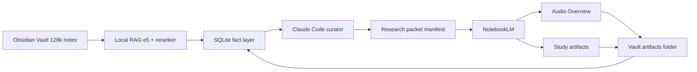
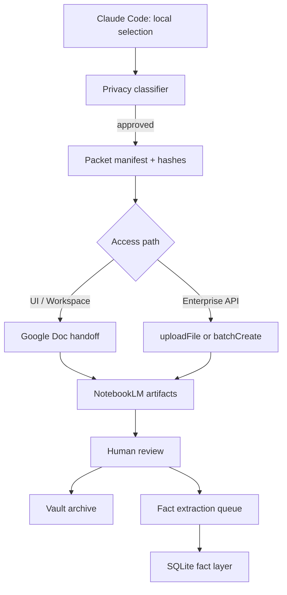
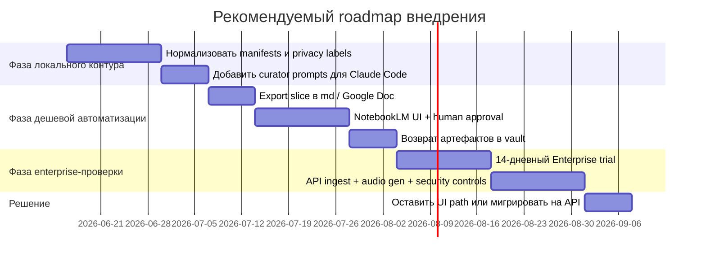

# Архитектура NotebookLM для личного цифрового двойника поверх Obsidian и Claude Code

## Executive Summary

Мой главный вывод на июнь 2026 года такой: **NotebookLM лучше всего использовать не как ядро памяти и не как основной RAG-движок, а как внешний слой “grounded artifacts” поверх уже существующего локального контура** — то есть поверх вашего Obsidian-вольта, локального e5+rERANKER RAG и SQLite fact layer. Это особенно верно для вашего масштаба: у NotebookLM есть лимиты на число источников на один notebook, а каждый notebook изолирован и не может одновременно работать через несколько notebooks. Поэтому прямой импорт всего vault в NotebookLM — плохая идея и архитектурно, и операционно. Гораздо лучше работает схема: **Claude Code локально отбирает узкий тематический slice из Obsidian → NotebookLM превращает этот slice в audio overview / study artifacts → результаты возвращаются обратно в vault как производные артефакты, а не как первичная память**. citeturn35search7turn26view0turn32view0turn22search4

Если моя цель — **максимальная простота, минимальный риск, нулевая ToS-серость и при этом сначала выжать всё из уже оплаченных подписок**, то лучший путь — **двухступенчатый**. Сначала я строю **subscription-first semi-automation**: Claude Code локально готовит пакет, экспортирует его в `.md` и/или Google Doc, после чего я использую обычный NotebookLM UI или Workspace-included NotebookLM для генерации аудио и учебных артефактов. Это дешево, ремонтопригодно и почти не требует инфраструктуры. Затем, только если станет реально больно от ручных approval-gates, я перехожу на **NotebookLM Enterprise API** — но не ради “общения с тетрадью”, а ради **официального, поддерживаемого ingest + notebook lifecycle + audio generation**. При этом я не вижу в публичной документации полноценного consumer API, а в публичной Enterprise API-документации на текущий момент явно документированы notebook CRUD, source management и audio overview, но не полноценный documented chat/query/export surface уровня UI. citeturn3search8turn5search4turn32view0turn9search0turn8search0

**NotebookLM Enterprise** — правильный выбор, когда мне нужны: официальная автоматизация, IAM, data residency в EU/US, VPC-SC, CMEK, Access Transparency, более жесткий admin perimeter и снижение риска утечки чувствительного персонального корпуса. Но экономически это не “хобби-API”: публичная страница Google Cloud указывает цену **$9 за лицензию в месяц** с годовой скидкой, а документация по лицензированию пишет, что подписка содержит **минимум 15 лицензий**, плюс есть 14-дневный trial на 5000 лицензий. Для одного оператора это обычно означает, что **Enterprise стоит брать не ради любопытства, а только если нужны compliance/automation преимущества, которые реально перевешивают стоимость и сложность**. citeturn29view0turn28search6

**`notebooklm-py`** производит сильное впечатление как инженерный обходной путь: у проекта большая активность, встроенные agent skills для Claude Code/Codex/OpenClaw, команды на генерацию аудио, видео, слайдов, mind maps и скачивание артефактов. Но его собственный README честно говорит, что он использует **undocumented Google APIs**, которые могут меняться без предупреждения, а troubleshooting и release notes показывают, что значительная часть усилий уходит на auth/cookie stability, CSRF refresh, account routing и anti-automation friction. Для прототипов — да. Для приватного долговременного контура “digital twin” — только в карантинной зоне и только как временный bridge, пока официальный surface недостаточен. citeturn11search0turn23search1turn23search2turn23search3

С точки зрения приватности, картина не бинарная, а слоистая. Для **личного consumer-аккаунта** Google пишет, что данные не используются для обучения NotebookLM, **если не отправлять feedback**; но если feedback отправлен, human reviewers могут просматривать запросы, загрузки и ответы для отладки, abuse и улучшений. Для **Workspace / Education** Google пишет жестче: загрузки, запросы и ответы не используются для обучения моделей и не просматриваются human reviewers. Для **NotebookLM Enterprise** данные остаются в вашем Google Cloud project, поддерживаются VPC-SC, CMEK, data residency и enterprise controls. Поэтому для по-настоящему чувствительного second brain я бы не строил автоматический поток через personal NotebookLM; минимально приемлемый облачный вариант — Workspace, а нормальный вариант для высокочувствительных данных — Enterprise. citeturn2search3turn2search8turn26view0turn25search4turn25search0

Наконец, есть важное стратегическое противоречие. С одной стороны, **потребительский/Workspace NotebookLM двигается очень быстро**: Deep Research, DOCX/Sheets/images, cinematic/video overviews, более глубокие audio overviews, интеграция с Gemini notebooks, а с июня 2026 — Gemini 3.5, Antigravity и secure cloud computer внутри notebook. С другой стороны, публично документированная Enterprise API-поверхность выглядит заметно уже. Это означает, что в 2026 году **лучший production-подход для “digital twin” — гибридный**: локальный vault остается системой записи и reasoning spine; NotebookLM — это внешний artifact engine; а выбор пути доступа зависит не от “что круче”, а от баланса между privacy, automation и ToS-risk. citeturn34search0turn34search1turn34search2turn34search11turn32view0turn9search0

## Key Findings

Исследовательская литература довольно хорошо поддерживает саму идею **не скармливать длинный корпус напрямую, а сначала делать curated slice + hierarchical condensation**. Работы по long-context RAG и summarization показывают, что глобальная семантическая структура и hierarchical refinement улучшают ответы на сложных длинных корпусах и снижают шум; при этом глобальные corpus-level задачи остаются трудными даже для сильных систем. Это напрямую бьет в архитектурное решение: ваш локальный слой должен сначала отбирать релевантный подкорпус и строить “research packet”, а уже потом отдавать его в NotebookLM для grounded analysis и аудио. citeturn16academia36turn15academia48turn16academia37turn16academia39

Исследования по PKM и Obsidian тоже поддерживают идею curated access вместо “свалки из всех заметок”. В case study по Obsidian исследователи показывают, что стратегия извлечения знаний влияет на то, как люди строят и поддерживают second brain. Иными словами: retrieval strategy — не деталь реализации, а конструктивный принцип системы. Для вас это означает, что **Claude Code должен быть не свободным chat-ботом по всему vault, а контролируемым curator-агентом**, который сначала собирает slice, provenance и fact manifest. citeturn15academia47turn15search3

Есть и прямое академическое подтверждение полезности NotebookLM как grounded study layer. Бумага про NotebookLM как RAG-систему для активного обучения в физике описывает его как недорогой, легко внедряемый, traceable grounded tutor, полезный именно в режиме teacher-provided sources и study artifacts. Это не доказательство для enterprise automation, но это хороший аргумент в пользу вашей общей продуктовой роли NotebookLM: **не вместо памяти, а как движок объяснения, пересказа и учебных артефактов по доверенному корпусу**. citeturn11academia56

В индустрии Google продвигает NotebookLM именно в этой роли. Workspace-позиционирование делает акцент на grounded answers с citations, audio overviews, mind maps и обучающие/аналитические use cases, а customer stories показывают использование для research synthesis, training development и competitive analysis. Infoxchange пишет о сокращении review time примерно на неделю, Carbon Group — о конкурентном анализе, выполняемом существенно быстрее; на продуктовой странице Google также приводит кейсы Rivian и Sonata Design. Это важно потому, что описанный вами use case — не экзотика, а прямое попадание в то, как Google сам продает NotebookLM. citeturn14search3turn14search4turn14search2turn5search4

Где evidence слабее — так это в **официально задокументированных связках именно “NotebookLM + Claude Code + Obsidian”**. Здесь основная реальная практика — community/OSS. Есть `notebooklm-py`, который прямо позиционируется как unofficial Python API и agent skill для Claude Code/Codex/OpenClaw; есть community-проекты автоматизации вроде Lore; есть плагины и воркфлоу для связи Obsidian с Claude Code, включая прямой vault access, sidebar integrations и MCP/skill-подходы. То есть рынок уже “нащупал” этот стек, но **надежность и поддержка здесь по большей части community-grade, а не vendor-grade**. citeturn11search0turn11reddit38turn12reddit48turn12reddit49turn12search0turn12search1

Самый сильный операционный инсайт — **NotebookLM нельзя делать центральным programmatic knowledge API для вашего twin в 2026 году**. Публичные Enterprise docs однозначно показывают официальные методы для notebook creation, source batch create/upload и audio overview generation, но в них я не нашел такого же зрелого documented surface для programmatic query/chat + artifact export/download, как это видно в UI и заявляется в community wrappers. Поэтому система должна быть спроектирована так, чтобы **все знание и факты жили локально**, а NotebookLM был replaceable outer layer. Тогда вы не привязываете жизнеспособность “цифрового двойника” к одной beta/pre-GA облачной поверхности. citeturn8search0turn32view0turn9search0turn26view0



С практической точки зрения наилучший базовый паттерн выглядит так: **локальный curator → облачный artifact layer → локальный archive/graph enrichment**. Это соответствует ограничениям NotebookLM по размеру и независимости notebooks, а также соответствует лучшим практикам long-context RAG из исследований. citeturn35search10turn35search9turn16academia36turn16academia37

### Сравнение путей доступа

Ниже — моя прикладная сравнительная матрица. Она опирается на официальные политики/лимиты Google для NotebookLM и Enterprise, публичную цену/лицензирование Enterprise, а также на собственные предупреждения и troubleshooting проекта `notebooklm-py`. citeturn31search0turn26view0turn29view0turn28search6turn11search0turn23search1turn24search3

| Путь доступа | Приватность | Надежность | Стоимость | Поддержка / maintenance | ToS-риск | Латентность | Идемпотентность | Масштабируемость |
|---|---|---|---|---|---|---|---|---|
| Ручной Google Doc → NotebookLM UI | Средняя для personal, выше для Workspace | Высокая | Обычно включено в подписку | Низкий maintenance | Низкий | Средняя | Низкая без manifest, средняя с manifest | Низкая–средняя |
| `notebooklm-py` | Зависит от аккаунта; хранит auth cookies локально | Средняя–низкая | Низкая прямые затраты, но скрытый ops-cost | Высокий maintenance | Средний–высокий | Средняя | Средняя при хорошем wrapper | Средняя |
| NotebookLM Enterprise API | Высокая | Наиболее высокая из официальных вариантов, но часть surface Pre-GA | Существенная: минимум 15 лицензий, публично от $9/seat/mo | Средний maintenance | Низкий | Низкая–средняя | Высокая | Высокая |

Мой практический вывод из этой таблицы: **для одиночного оператора и правила “сначала выжать всё из включённых подписок” победитель — не Enterprise API, а disciplined manual/semiautomatic handoff**. **Для серьезной автоматизации с чувствительными данными победитель — Enterprise API**, но только если вы готовы платить не за токены, а за compliance и управляемость. **`notebooklm-py` — это мост, а не фундамент**. citeturn29view0turn28search6turn11search0turn23search2turn26view0

## Contradictions & Debates

Главное противоречие рынка в 2026 году выглядит так: **самый мощный NotebookLM по пользовательским возможностям — не обязательно самый хороший NotebookLM по API-доступности**. Июньское обновление NotebookLM добавило Gemini 3.5, agentic reasoning, secure cloud computer и code execution прямо внутри notebooks, а более ранние обновления принесли Deep Research, новые file types, cinematic video overviews, video/audio upgrades и синхронизированные notebooks в Gemini. Но публичная Enterprise API-документация, которую я нашел, значительно уже: notebook lifecycle, sources, audio overview. Это указывает на возможный разрыв между UI-скоростью продукта и зрелостью programmatic surface. citeturn34search0turn34search1turn34search2turn34search11turn32view0turn9search0

Второе противоречие — **privacy posture против удобства**. Consumer NotebookLM и Google AI plans дают дешёвый и быстрый доступ, но consumer-политика оставляет оговорку про human review при feedback. Workspace уже заметно лучше: no human review и no training on your uploads/queries/responses. Enterprise даёт лучший perimeter, data residency, VPC-SC, CMEK, Access Transparency и project-bound storage. Поэтому “дешево и удобно” и “максимально приватно” здесь не совпадают. Если в vault есть действительно чувствительные персональные материалы, я считаю, что personal-account automation — плохая идея, даже если она технически работает. citeturn2search3turn2search8turn26view0turn25search4turn25search0

Третье противоречие — **официальность против полноты функционала**. `notebooklm-py` и смежные community-проекты обещают почти всё, чего хочет power-user: installable skills для Claude Code, chat, generation, downloads, metadata export, multi-profile auth, even capabilities “which the web UI doesn’t expose”. Но ровно потому, что это строится поверх undocumented interfaces, проект сам предупреждает о нестабильности, rate limits и том, что Google может всё поменять без предупреждения. И release notes подтверждают, что большая часть инженерной работы там — это борьба за auth lifecycle и изменение RPC shape. То есть наиболее “полная” автоматизация одновременно наиболее хрупкая. citeturn11search0turn23search1turn23search2

Есть и юридико-политический спорный слой. Я не стал бы категорически писать, что любой unofficial client автоматически нарушает ToS, потому что это требует product-specific legal reading и часто зависит от конкретного способа доступа. Но риск точно **ненулевой**: Google в текущих Terms запрещает misuse services и использование automated means для доступа к контенту сервисов в нарушение машинно-читаемых инструкций, а старая редакция Terms формулировала запрет на доступ “through any automated means” еще прямее. В сочетании с тем, что `notebooklm-py` использует undocumented APIs и Google может детектировать automation, я бы рассматривал этот путь как **policy-fragile by design**. citeturn24search3turn24search0turn24search1turn11search0turn23search1

Последний важный спор — **нужно ли вообще связывать digital twin с NotebookLM**. Мой ответ: да, но только при условии, что NotebookLM — это не memory substrate, а **artifact and reflection layer**. Исследования по global RAG показывают, что corpus-level reasoning все еще слабое место, а сам NotebookLM ограничен независимыми notebooks и квотами. Поэтому стратегически правильнее считать его “временным explainability frontend” над curated packets, а не “местом, где живет ваш интеллект”. citeturn16academia39turn35search10turn26view0

## Best Practices

Моя базовая рекомендация — строить систему по принципу **local-first memory, cloud-for-artifacts**. То есть факты, долговременная персональная память, нормализованные entity/relation records, embeddings и provenance должны жить локально: в Obsidian, SQLite и локальном RAG. В NotebookLM должны попадать только **эпизодические тематические view’ы**, специально собранные под inquiry, review cycle, study packet, weekly synthesis или audio digest. Это и лучше для приватности, и лучше для квот, и лучше для качества выводов. citeturn26view0turn35search10turn16academia36turn15academia47

Второе правило — **каждый slice должен быть манифестом, а не просто набором файлов**. Я бы хранил рядом с каждым research packet JSON/YAML manifest со следующими полями: `slice_id`, `topic`, `source_note_ids`, `source_hashes`, `selection_reason`, `fact_refs`, `privacy_class`, `notebooklm_target`, `approved_by_human`, `artifact_status`. Это делает поток идемпотентным: если hashes не изменились, пересоздавать notebook и regenerate audio не нужно. Такой подход также компенсирует тот факт, что NotebookLM работает со статическими копиями источников и не синхронизирует изменения автоматически для большинства format-типов; даже в UI для Google Docs/Slides нужен ручной re-sync, а остальные типы надо удалять и загружать заново. citeturn31search0turn32view0

Третье правило — **не использовать Google Doc как универсальный format по умолчанию там, где есть официальный file upload**. Для consumer/Workspace UI ручной Google Doc хэнд-офф действительно удобен: это естественный human approval gate и хорошая читаемость. Но для Enterprise API прямой upload `.md`, `.pdf`, `.docx`, `.pptx`, `.xlsx` и raw text уже официально поддержан. Поэтому для официальной автоматизации в 2026 году лучшая связка не “md → Google Doc → API”, а **`md → uploadFile(text/markdown)`** либо `textContent`/`batchCreate`. Google Doc через API имеет смысл оставлять только там, где вам критично совместное редактирование человеком до отправки в NotebookLM. citeturn32view0turn31search0

Четвертое правило — **human approval должен стоять перед облаком, а не после него**. Не после генерации аудио проверять “ой, туда ушли личные данные”, а до отправки проверить privacy class slice: `public`, `internal`, `sensitive`, `do_not_upload`. Для sensitive slices я бы вообще запрещал personal-account routes и разрешал только Enterprise либо полностью локальный substitute stack. Если включать Enterprise, я бы добавил EU region, IAM minimum access, при необходимости CMEK и Model Armor — но с пониманием, что Model Armor может увеличить latency. citeturn25search4turn25search0turn27search0turn26view0

Пятое правило — **не смешивать артефакты NotebookLM с первичными фактами**. Audio overview, flashcards, quizzes, reports, decks и even “insight summaries” должны сохраняться в vault как производные объекты с provenance: какой slice, какая версия, какие source hashes, какой prompt/focus, какая дата генерации. Фактовый слой должен извлекать из них только явно одобренные человеком утверждения. Иначе “цифровой двойник” быстро превратится в рекурсивную смесь пересказов о пересказах. citeturn35search7turn26view0



### Практическая рекомендованная архитектура

Если мне нужно выбрать **одну** архитектуру на 2026 год под ваши ограничения, я выбираю такую:

1. **Локально**: Claude Code работает только по локальному vault и локальному SQLite fact layer.  
2. **Curator mode**: он не “общается со всем vault”, а собирает `research_packet/` из 10–80 заметок и связанных выдержек.  
3. **Approval gate**: человек утверждает пакет и privacy class.  
4. **Дальше два канала**:  
   - **канал по умолчанию**: Google Doc / Workspace NotebookLM UI;  
   - **канал для automation/compliance**: NotebookLM Enterprise API.  
5. **Назад в vault**: mp3, markdown summary, slide/report exports, manifest, prompt, source hashes, human rating.  
6. **Факт-слой**: только вручную подтвержденные выводы попадают в SQLite.  

Это дает repairability, повторяемость и снижает vendor lock-in. citeturn31search0turn32view0turn26view0turn34search0

## Failure Modes

Самая очевидная техническая точка отказа — **неустойчивость unofficial automation**. `notebooklm-py` сам предупреждает, что использует undocumented APIs, а troubleshooting описывает auth errors, automatic token refresh, CSRF/session refresh, browser-login failures из-за automation detection, необходимость cookies и ручного re-login. Release notes отдельно акцентируют “auth/cookie stability remediation”, SIDTS rotation и fail-closed behavior из‑за хрупкости auth-контуров. Практический перевод на человеческий язык: если вы завяжете production-поток на этот слой, вы будете чинить не бизнес-логику, а куки, маршрутизацию аккаунта и изменения RPC. citeturn11search0turn23search1turn23search2turn23search3

Вторая точка отказа — **policy/abuse detection**. Google может блокировать automation-like поведение CAPTCHA и другими ограничениями; сам troubleshooting `notebooklm-py` прямо говорит, что Google может детектировать automation и блокировать login. В сочетании с общими Terms про misuse/automated access это означает бан-риск не как теорию, а как практическую операционную проблему. Я бы не ставил такой контур на основной персональный Google-аккаунт, где хранятся почта, Drive и другой ценный state. citeturn23search1turn24search3turn24search0

Третья точка отказа — **ложное ощущение “полной автоматизации” через Enterprise API**. Официальные Enterprise docs очень хороши для ingest и lifecycle, но публично документированная история с downstream export менее ясна. По audio overview docs вижу documented create/delete и управление через Studio UI, а help/docs для consumer UI прямо описывают загрузку и sharing через интерфейс. Я **не нашел в публичной Enterprise API-документации явного REST-метода для скачивания сгенерированного MP3**. Это не значит, что такого пути не существует где-то в другом surface, но как публичный, стабильный, documented contract я его не увидел. Следствие: “полностью без человека загнать в NotebookLM и получить обратно mp3” на официальных публичных docs пока выглядит неполностью закрытым. citeturn9search0turn6search2

Четвертая точка отказа — **утечка чувствительных данных в неправильный trust zone**. Personal NotebookLM не обучается на данных по умолчанию, но feedback может привести к human review контекста взаимодействия. Для многих личных second brain corpus этого уже достаточно, чтобы считать personal route неприемлемым для высокочувствительных материалов. Workspace и Enterprise заметно безопаснее, но и там надо помнить про общие Google Cloud generative-AI механизмы abuse monitoring; в общих Google Cloud docs есть описание limited prompt logging для abuse monitoring в некоторых сценариях. Для NotebookLM Enterprise это нужно проверять с sales/legal отдельно, если требования совсем жесткие. citeturn2search3turn2search8turn2search1turn2search7

Пятая точка отказа — **потеря идемпотентности и provenance**. NotebookLM работает со статическими копиями загруженных источников; ваши локальные заметки меняются, но notebook остается старой версией, если вы не сделали явный re-ingest. Для Google Docs/Slides в UI синхронизация тоже не автоматическая, а manual re-sync; для остальных типов нужен re-upload. Значит, без source hashes и manifests вы очень быстро перестанете понимать, к какой версии vault относится конкретный audio overview. Для “digital twin” это неприемлемо. citeturn31search0turn26view0

## Strategic Recommendations

Моя стратегическая рекомендация предельно простая: **в 2026 году я бы не строил “personal digital twin” на NotebookLM; я бы строил его на локальном Obsidian+RAG+SQLite, а NotebookLM делал сменным artifact-engine уровнем**. Это наиболее устойчиво к изменениям API, pricing, ToS и продуктовой стратегии Google. Такой подход также соответствует состоянию исследований и реальной зрелости доступных интерфейсов. citeturn16academia36turn16academia39turn26view0turn34search0

Если мне нужно выбрать путь доступа **сегодня**, то решение такое:

**Я выбираю manual Google Doc / Workspace handoff**, если:
- я один пользователь;
- я хочу выжать максимум из уже включенной подписки;
- я хочу простую, ремонтопригодную систему;
- я могу принять полуавтоматический approval gate;
- мой корпус чувствителен, но не настолько, чтобы оправдать Enterprise spend. citeturn5search4turn31search0turn35search9

**Я выбираю NotebookLM Enterprise API**, если:
- мне нужна официальная программная загрузка `.md`/text/files;
- я хочу IAM, VPC-SC, CMEK, EU residency, project-bound isolation;
- мне нужен batch lifecycle management notebooks;
- я готов оплатить минимум 15 лицензий и принять, что часть surface все еще Pre-GA;
- мой сценарий — это controlled automation, а не только личная productivity. citeturn29view0turn28search6turn26view0turn25search4turn32view0

**Я выбираю `notebooklm-py` только как временный bridge**, если:
- мне критично нужна consumer/UI-функциональность, которой нет в официальном API;
- я готов к breakage;
- я могу изолировать риск в отдельном аккаунте и отдельном automation host;
- я не отправляю туда crown-jewel notes;
- у меня есть fallback path на manual UI или Enterprise API. citeturn11search0turn23search1turn23search2turn24search3

### Стоимость и когда что выбирать

Официальные публичные данные позволяют сделать довольно прагматичную cost-модель, хотя **детальной public per-call pricing по NotebookLM Enterprise API я не нашел**. Из公开тых источников видно: Enterprise продается по подписке, минимум 15 лицензий, есть 14-дневный trial, публичный landing page указывает $9/seat/month и годовую скидку; для consumer/AI plans Google AI Pro и Plus дают NotebookLM с повышенными лимитами. citeturn29view0turn28search6turn30search0turn30search4turn35search9

| Сценарий | Что я бы выбрал | Примерный публично видимый cost floor |
|---|---|---|
| Один пользователь, уже есть Google AI Pro / Workspace | UI handoff | от уже оплаченной подписки; в Португалии Google AI Pro показывается как €21.99/мес, Plus — €7.99/мес, но если подписка уже есть, маржинальная стоимость для NotebookLM близка к нулю citeturn30search1turn30search4 |
| Один пользователь, без платного плана | Free/Standard NotebookLM для теста, затем Plus/Pro при упоре в квоты | Free = 100 notebooks / 50 sources / 3 audio per day; Pro = 500 notebooks / 300 sources / 20 audio per day citeturn35search9turn6search0 |
| Нужна официальная автоматизация и сильная приватность | Enterprise API | минимум 15 лицензий; публичный floor ~ $135/мес до скидок, точной публичной per-API тарификации я не вижу citeturn29view0turn28search6 |
| Нужна почти полная автоматизация без Enterprise spend | `notebooklm-py` | денег мало, ops-боли много; скрытая цена — поддержка и риск отказов citeturn11search0turn23search2 |

Мой строгий выбор под ваше правило “**сначала исчерпать included tiers**” такой:

- **Фаза по умолчанию**: Workspace/AI Pro/AI Plus NotebookLM UI.  
- **Только потом**: Enterprise API trial на 14 дней для проверки реальной ценности официальной автоматизации.  
- **Не делать ставку на `notebooklm-py` как основной production path**; максимум — как временный connector между фазами. citeturn28search6turn30search1turn35search9turn11search0

## Action Plan

Ниже — мой рекомендуемый пошаговый план, который дает максимум практической пользы без преждевременного усложнения.



### Фаза локального контура

Сначала я бы сделал только то, что повышает качество и идемпотентность без облака:

1. Добавить к заметкам или к SQLite fact layer классификацию `privacy_class`.
2. Ввести `slice_manifest.json`.
3. Ввести стабильные `source_hash`.
4. Добавить каталог вроде:
   ```text
   vault/
     _packets/
     _artifacts/notebooklm/
     _manifests/
   ```
5. Научить Claude Code работать в режиме curator, а не freeform agent. citeturn15academia47turn31search0

Пример системного промпта для Claude Code:

```text
Ты работаешь только как curator личного knowledge vault.
Цель: собрать узкий тематический slice для NotebookLM.

Правила:
- не отправляй в облако ничего, пока не сформирован manifest
- выбирай только заметки с прямой релевантностью к теме
- на каждую заметку запиши reason_for_inclusion
- присвой privacy_class
- создай packet_summary.md, source_manifest.json, fact_candidates.json
- если есть PII, медицинские или финансовые личные детали, пометь slice как sensitive
- не редактируй исходные заметки, кроме добавления backlinks в отдельный draft-файл
```

### Фаза дешевой автоматизации

Дальше я бы делал semiautomatic pipeline с явным approval gate:

1. Claude Code собирает `packet_summary.md`.
2. Скрипт конвертирует его в Google Doc **или** оставляет как `.md` для ручного upload.
3. Я вручную открываю NotebookLM, создаю notebook, загружаю пакет.
4. Генерирую:
   - Audio Overview
   - Study Guide / Report
   - при необходимости Flashcards / Quiz / Slide Deck
5. Загружаю артефакты обратно в vault.  
   Google help прямо говорит, что audio можно download’ить из UI; изменение экспортированных Docs/Sheets не синхронизируется обратно в NotebookLM. citeturn6search2turn35search7

### Фаза Enterprise trial

Если semiautomation реально экономит время и bottleneck — именно ручной ingest, я бы запустил 14‑дневный trial Enterprise и проверил только критические вещи:

- Как быстро создаются notebooks и sources через API.
- Хватает ли публичного API surface для нужного вам automation loop.
- Можно ли обойтись без undocumented export/download.
- Нужен ли вам EU region.
- Нужны ли Model Armor и CMEK. citeturn28search6turn32view0turn25search0turn27search0

Пример API-последовательности:

```bash
# 1. create notebook
curl -X POST \
  -H "Authorization: Bearer $(gcloud auth print-access-token)" \
  -H "Content-Type: application/json" \
  "https://eu-discoveryengine.googleapis.com/v1alpha/projects/PROJECT/locations/eu/notebooks" \
  -d '{"title":"packet--sleep-architecture--2026-06-16"}'

# 2. upload markdown packet
curl -X POST --data-binary "@packet_summary.md" \
  -H "Authorization: Bearer $(gcloud auth print-access-token)" \
  -H "X-Goog-Upload-File-Name: packet_summary.md" \
  -H "X-Goog-Upload-Protocol: raw" \
  -H "Content-Type: text/markdown" \
  "https://eu-discoveryengine.googleapis.com/upload/v1alpha/projects/PROJECT/locations/eu/notebooks/NOTEBOOK_ID/sources:uploadFile"

# 3. create audio overview
curl -X POST \
  -H "Authorization: Bearer $(gcloud auth print-access-token)" \
  "https://eu-discoveryengine.googleapis.com/v1alpha/projects/PROJECT/locations/eu/notebooks/NOTEBOOK_ID/audioOverviews" \
  -d '{
    "episodeFocus": "Сделай grounded deep-dive для личного обучения. Отдельно выдели спорные места и actionable выводы.",
    "languageCode": "ru"
  }'
```

Официальная база для такой последовательности существует: `notebooks.create`, `sources.uploadFile` и `audioOverviews.create` документированы публично. citeturn8search0turn32view0turn9search0

### Human approval gates

Я бы не убирал человека совсем. Минимум три approval gate должны остаться:

1. **До отправки** — утверждение slice и privacy class.  
2. **После генерации** — проверка качества audio/report и решение, возвращать ли это в vault.  
3. **Перед fact-layer ingestion** — подтверждение, какие выводы превращаются в долговременные факты. citeturn16academia37turn15academia47

### Open questions and limitations

Есть несколько моментов, которые я считаю не полностью закрытыми на публичных источниках по состоянию на **2026-06-16**:

- Я **не нашел публично документированного consumer API** для NotebookLM и **не нашел официального roadmap с датами выпуска**.  
- Я **не нашел в публичной Enterprise API-документации явного documented endpoint для скачивания сгенерированного audio file**, хотя создание audio overview документировано, а UI-download описан в help.  
- Я **не нашел полной публичной per-call/per-generation price card** для NotebookLM Enterprise API; публично доступна seat pricing/logics, а не детальный API-billing breakdown.  
- Часть Enterprise API surface помечена как **Preview / Pre-GA**, что снижает прогнозируемость contracts. citeturn32view0turn9search0turn29view0turn28search6

## Sources

Ниже — самые важные источники, на которых я бы сам опирался при проектировании, в порядке приоритета.

Официальная документация Google Cloud по NotebookLM Enterprise:
- Overview, limits, differences from personal NotebookLM, data lifecycle, IAM, sharing, availability. citeturn26view0
- Create and manage notebooks API. citeturn8search0
- Add/manage data sources API, upload markdown/text/files. citeturn32view0
- Audio overview API. citeturn9search0
- Licensing: minimum 15 seats, 14-day trial. citeturn28search6
- Enterprise pricing landing page: $9/license/month public floor. citeturn29view0
- CMEK. citeturn25search0
- Compliance and security controls: VPC-SC, CMEK, Access Transparency, DRZ. citeturn25search4
- Model Armor. citeturn27search0
- Standalone Podcast API and its deprecation / no new allowlisting. citeturn33search0

Официальная документация и help по consumer / Workspace NotebookLM:
- Learn about NotebookLM; data handling distinctions. citeturn2search3turn35search0
- Upgrade NotebookLM and quotas across Standard/Plus/Pro/Ultra. citeturn35search9turn6search0
- Add or discover sources; static copies; manual re-sync; Drive nuances. citeturn31search0
- Create notebook; notebooks are independent; exports don’t sync back. citeturn35search7
- Audio overview UI behavior and download/share notes. citeturn6search2
- Workspace product page showing NotebookLM in Workspace plans and privacy language. citeturn5search4turn14search2

Официальные блоги Google о recent product direction:
- June 2026 “Do better research with NotebookLM” — Gemini 3.5, Antigravity, secure cloud computer. citeturn34search0
- November 2025 Deep Research and broader source types. citeturn34search1
- March 2026 cinematic video overviews. citeturn34search2
- April 2026 notebooks in Gemini syncing with NotebookLM. citeturn34search11
- 2025 multilingual / richer audio-video overviews. citeturn34search3turn22search2

Открытые community / OSS источники по неофициальной автоматизации:
- `teng-lin/notebooklm-py` README. citeturn11search0
- `notebooklm-py` troubleshooting. citeturn23search1
- `notebooklm-py` release notes about auth/cookie stability. citeturn23search2
- Lore and community automation discussions. citeturn11reddit38
- Obsidian + Claude Code community setups and plugins. citeturn12reddit48turn12reddit49turn12search0turn12search1

Академические и технические работы:
- NotebookLM as RAG tutor for active learning. citeturn11academia56
- Obsidian second-brain case study. citeturn15academia47turn15search3
- LongRefiner for long-context RAG. citeturn16academia36
- Context-aware hierarchical merging for long-document summarization. citeturn16academia37
- MiA-RAG for long-context understanding. citeturn15academia48
- GlobalQA / GlobalRAG corpus-level benchmark. citeturn16academia39
- Engineering pitfalls in AI coding tools. citeturn12academia62

Альтернативы NotebookLM для аудио/артефактов:
- Google Illuminate / Learn Your Way lineage. citeturn22search6turn22search0
- ElevenLabs Text to Dialogue. citeturn17search4
- Gemini 3.1 Flash TTS / Live. citeturn22search5turn22search3
- Podcastfy open-source alternative. citeturn20search0
- Microsoft VibeVoice. citeturn19search0turn19search5
- Muyan-TTS for podcast scenarios. citeturn18academia49

Мой финальный выбор при ваших ограничениях: **сейчас строить local-first curated pipeline, использовать NotebookLM UI/Workspace как основной artifact layer, заложить manifests и approval gates с первого дня, а Enterprise API включать только после реального подтверждения, что ручной ingest стал bottleneck и что compliance/automation действительно стоят минимум 15 лицензий.** `notebooklm-py` — только как временный мост, а не как скелет “цифрового двойника”. citeturn29view0turn28search6turn11search0turn26view0