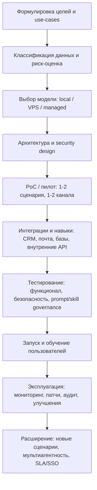

# Рынок и поставщики вокруг OpenClaw: сетапы, интеграторы, риски и альтернативы

## Резюме для руководителя

OpenClaw — популярный open‑source «персональный AI‑агент», который способен не только отвечать в чате, но и выполнять действия (почта, файлы, автоматизации, интеграции) через каналы вроде WhatsApp/Telegram и пр., при этом основная идея проекта — запуск «у вас» (локально/на своём сервере), а не в чужом SaaS. citeturn31view0turn34search33

Рынок вокруг OpenClaw в 2026 году уже разделился на несколько слоёв:  
- **DIY/self‑host** (локально или VPS) — максимум контроля, но максимум ответственности за безопасность и эксплуатацию. citeturn35view0turn34search2  
- **Коммерческие интеграторы/«под ключ»** (профессиональные услуги) — установка, hardening, интеграции, навыки/skills, мониторинг, обучение. citeturn19view0turn27view0turn25view0turn28view0  
- **Managed‑платформы** (хостинг/управление OpenClaw как сервис) — меньше DevOps‑нагрузки, но выше риск vendor lock‑in и вопросов к прозрачности/юридике. citeturn7view0turn29view0  
- **«Обёртки»/десктоп‑дистрибутивы** (однокнопочные локальные установщики и sandbox‑рантайм) — компромисс между удобством и локальностью. citeturn16view0turn15view0  

Ключевой драйвер спроса на интеграторов — **безопасность экосистемы навыков (skills) и экспозиция незащищённых инстансов**. Независимые исследования фиксировали десятки тысяч публично доступных инстансов и значимый процент уязвимых/вредоносных навыков в публичных реестрах. citeturn34search1turn30search1turn30search2turn30search3turn30search17turn34search6  
Проект официально объявил сканирование навыков через entity["organization","VirusTotal","threat intel platform"] (в том числе с LLM‑анализом Code Insight) как один из слоёв защиты, подчёркивая, что это **не «серебряная пуля»**. citeturn32view0

По проверке пользовательских наименований:  
- **Entrpocic** — по доступным источникам не подтверждается как компания/продукт в контексте OpenClaw; наиболее вероятно, это опечатка/ошибка памяти. citeturn18search0turn18search7  
- **Entropic** — подтверждённый продукт (десктоп‑приложение/локальная «рабочая среда» для OpenClaw, с pay‑as‑you‑go биллингом и публикацией исходников). citeturn16view0turn17view0turn15view0  
- **ClawUp** — подтверждённый managed‑сервис/платформа для управляемого развёртывания OpenClaw; по брендингу/юридике есть неоднозначности, требующие due diligence перед закупкой. citeturn11search2turn7view0turn8view0turn13view0turn12view0  

## Что такое OpenClaw и что реально нужно для продакшена

### Официальный проект, репозиторий, лицензия

Официальная витрина проекта — сайт OpenClaw, позиционирующий продукт как «AI, который реально делает дела»: управление inbox, отправка писем, календарь, действия «из любого чат‑приложения». citeturn31view0  
Основной исходный код опубликован в репозитории на entity["company","GitHub","code hosting platform"], лицензия проекта — **MIT** (подтверждено файлом LICENSE). citeturn6view0turn3view0

Проект ассоциирован с основателем/мейнтейнером **entity["people","Peter Steinberger","openclaw creator"]** (упоминается как создатель/автор в публичных материалах и сторонних обзорах). citeturn32view0turn27view0turn34search6

### Функциональность «по сути»

Если сжать функциональность до практического ядра, OpenClaw обычно включает:  
- **Каналы общения** (мессенджеры/чаты), где агент «живёт» и принимает команды. citeturn31view0turn33view0  
- **Навыки/skills (расширения)**, которые дают агенту доступ к инструментам (API, файловая система, автоматизация, интеграции). citeturn32view0turn30search1  
- **Исполнение действий** (локально/в контейнере/на сервере), что резко повышает ценность, но столь же резко повышает риски. citeturn34search2turn30search3  

### Безопасность как «главная ось» рынка

Текущий ландшафт угроз вокруг OpenClaw можно описать тремя «классами» проблем:

1) **Экспонированные инстансы**  
Исследование entity["company","Bitsight","cyber risk ratings company"] фиксировало «more than 30000» публично доступных инстансов и подчёркивало, что это привлекает нежелательное внимание атакующих. citeturn34search1turn30search0  

2) **Supply‑chain риск в реестрах навыков (skills)**  
entity["company","Snyk","developer security platform"] описывал результаты исследования ToxicSkills: сканирование 3,984 skills из ClawHub/skills.sh и долю skills с security flaws порядка 36% (в их же публикациях фигурируют детали по критичности и типам атак). citeturn30search1turn30search9turn30search32turn30search17  
entity["company","Bitdefender","cybersecurity vendor"] публиковал тех. advisory о злоупотреблениях навыками и наличии значимого числа вредоносных навыков/кампаний (в разных материалах встречаются разные цифры и методологии). citeturn30search2turn30search6  

3) **«Agentic AI» повышает риск по определению**  
entity["company","Sophos","cybersecurity vendor"] прямо описывает «OpenClaw experiment» как предупреждение для enterprise‑безопасности: агентные системы расширяют поверхность атаки и требуют иных контролей. citeturn30search3turn30search7  

На русскоязычных тех‑ресурсах эти проблемы также отражались: отмечались волны вредоносных «навыков» и социальная инженерия в инструкциях/Markdown‑файлах. citeturn34search6turn34search9

### Официальный ответ проекта: сканирование навыков через VirusTotal

В феврале 2026 в официальном блоге заявлена интеграция ClawHub со сканированием entity["organization","VirusTotal","threat intel platform"]: упаковка навыка в детерминированный bundle, хеш‑lookup, загрузка на анализ, LLM‑ориентированный Code Insight, авто‑разрешение benign и блокировка malicious, плюс ежедневные пересканы. citeturn32view0  
В том же материале упомянуты (как участники/советники инициативы) **entity["people","Jamieson O'Reilly","security advisor"]** и **entity["people","Bernardo Quintero","virustotal founder"]**, и указан контакт security@openclaw.ai для реагирования. citeturn32view0

image_group{"layout":"carousel","aspect_ratio":"16:9","query":["OpenClaw GitHub repository screenshot","OpenClaw Virustotal partnership announcement screenshot","ClawHub OpenClaw skills marketplace screenshot","OpenClaw managed platform ClawUp dashboard screenshot"],"num_per_query":1}

## Рынок: типовые модели развёртывания и драйверы стоимости

### Типовые модели развёртывания

В практической плоскости рынок сводится к четырём вариантам (термины могут отличаться, но смысл одинаковый):  
1) **Локально на железе (bare metal)** — проще стартовать, но агент ближе к личным данным и OS. citeturn35view0turn34search2  
2) **Локально в Docker/изоляции** — больше контроля permission‑границ, но добавляется Docker‑слой и эксплуатация. citeturn35view0turn15view1  
3) **VPS/облако (self‑host)** — 24/7, но вы отвечаете за hardening, обновления, firewall и экспозицию. citeturn35view0turn19view0  
4) **Managed‑service/платформа** — меньше DevOps‑боли, но появляется зависимость от провайдера и вопросы к trust‑модели. citeturn35view0turn29view0turn7view0  

### Что формирует бюджет и сроки интеграции

На практике «стоимость внедрения OpenClaw» почти никогда не равна «стоимости OpenClaw», потому что сам OpenClaw MIT‑лицензионный/бесплатный, а деньги уходят в:  
- **Инфраструктуру и непрерывность** (VPS/облако, резервное копирование, аптайм, мониторинг). citeturn19view0turn29view0turn27view0  
- **Безопасность** (сегментация сети, секреты, audit‑логи, проверка/ограничение skills, обновления). citeturn32view0turn30search1turn30search0turn30search3  
- **Интеграции и кастомные навыки** (CRM/ERP/внутренние API; «skills» — это фактически ваш интеграционный код). citeturn19view0turn25view0turn27view0  
- **Коммерческие API‑расходы** (LLM‑токены, иногда платные каналы/WhatsApp Business API). citeturn28view0turn17view0turn27view0  
- **Обучение и операционные регламенты** (handover, runbooks, обучение сотрудников, ограничения полномочий). citeturn27view1turn28view0turn29view0  

### Типовой процесс закупки и интеграции

Ниже — практический «скелет» процесса (адаптируйте под тендер/закупочные политики):

Обоснование именно такого порядка — «security‑реальность» экосистемы: экспонированные инстансы и риски навыков делают обязательными этапы governance/изоляции/аудита до масштабирования. citeturn34search1turn30search1turn30search3turn30search17  

### Типичные диапазоны стоимости и сроков

Ниже — **оценки**, выведенные из публичных прайсов/таймлайнов нескольких поставщиков и типовых объёмов работ (не «истина», а ориентир для бюджетирования до получения коммерческих предложений):

- **Быстрый старт (1 агент, 1–2 канала, 2–3 кастомных навыка, базовый hardening)**: 1–2 недели, ~$2.5k–$15k, далее опциональная поддержка/ретейнер. База для оценки — публичные пакеты/ставки ряда исполнителей. citeturn27view1turn19view0  
- **Рабочий пилот для команды (3–5 каналов, CRM/почта, 5–10 навыков, мониторинг, обучение)**: 2–6 недель, ~$15k–$60k. Опирается на объединение публичных сроков/пакетов и типовых накладных на интеграции и безопасность. citeturn27view1turn25view0turn19view0  
- **Enterprise (несколько инстансов/агентов, SSO, аудит/логирование, комплаенс‑артефакты, пентест)**: 6–12+ недель, ~$60k–$250k+ (сильно зависит от требований и количества интеграций/данных). Компоненты работ перечислены и у managed‑провайдеров, и у интеграторов. citeturn29view0turn27view1  

## Вендоры и интеграторы

Ниже перечислены компании/платформы, **у которых на официальных страницах прямо заявлены услуги/продукты вокруг OpenClaw**. Для каждого пункта: если деталь не подтверждается в источниках — помечено как *не указано*.

### Entropic

**Что продают/делают.** Десктоп‑приложение «one‑click OpenClaw agent» с локальным sandbox‑исполнением, интеграциями (Gmail/Calendar/мессенджеры) и модель‑провайдерами; позиционируется как «лучший способ запускать OpenClaw» без ручной возни. citeturn16view0turn15view0  

**Модель бизнеса.** Pay‑as‑you‑go кредиты «без подписки», с возможностью использовать свои API‑ключи «в обход» их биллинга. citeturn17view0turn16view0  
В Terms/Privacy фиксируются зависимости вроде entity["company","Stripe","payments platform"] и entity["company","Supabase","backend as a service"], а также маршрутизация к провайдерам моделей (упоминается и entity["company","OpenRouter","llm routing service"] как часть цепочки в отдельных сценариях). citeturn17view1  

**Публичные цены.** На странице pricing указаны тарифы «за 1M токенов» по моделям и минимальная покупка $5; есть $0.50 free credits для нового аккаунта. citeturn17view0  

**Контакты и локация.** В Privacy/Terms указан email team@dominantenergy.io; физический адрес не указан. citeturn17view1turn17view2  

**Референсы/кейсы.** Публичных enterprise‑кейс‑стади на оф.сайте в просмотренных страницах не найдено; есть заявление об open‑sourcing кода и публикации на GitHub. citeturn15view0turn16view0turn17view3  

**Красные флаги/проверки.**  
- Разные сущности в публичных артефактах: на сайте встречается «Entropic Inc.» (footer), в Terms — «operated by Dominant Energy Inc.» и упоминается Dominant Strategies/Quai‑экосистема; это не обязательно мошенничество, но требует юридической верификации контрагента перед оплатой/внедрением. citeturn16view0turn17view2turn15view0  

### ClawUp

**Что продают/делают.** Managed‑платформа для развёртывания «Claws» (инстансов OpenClaw) с multi‑channel, marketplace‑моделью приложений/интеграций (MCP + hooks), аудитом и биллингом; декларируется privacy‑first (шифрование на диске, аудит, enterprise‑опции). citeturn11search2turn13view0  

**Модель бизнеса и цены.**  
- В документации описан usage‑based биллинг: compute ~$1.39/hour, storage $0.003/GB/hour, cap $10/месяц на Claw, 7‑дневный trial. citeturn7view0  
- На отдельном маркетинговом домене заявлен план $49/месяц и включённые $15/месяц AI credits. citeturn8view0  

**Контакты и локация.**  
- В политике privacy указан контакт для privacy‑вопросов: sd@eigen.market. citeturn12view0  
- На страницах Terms/Privacy оператором назван «BotMesh», но физическая локация/юрисдикция не раскрыты. citeturn13view0turn12view0  

**Референсы/кейсы.** Публичные кейсы в просмотренных страницах не представлены; есть продуктовая документация и описания возможностей. citeturn11search2turn7view0  

**Красные флаги/проверки.**  
- Несостыковка бренда/юр.лица между доменами: на clawup.org упоминается BotMesh, на clawup.io — «Tecmanic LLC»; это требует проверки «кто именно принимает деньги и несёт ответственность» (MSA/DPA/ToS). citeturn13view0turn8view0turn12view0  
- Кликабельный «Contact» на clawup.org уходит в email‑obfuscation и в нашем просмотре не открылся корректно; часть контактов доступна через policy‑страницы. citeturn13view1turn12view0  

### Valletta Software Development

**Что продают/делают.** Услуги «OpenClaw Setup Services»: облачное развёртывание (AWS/Azure/GCP), настройка Gateway/каналов/cron, кастомные skills и интеграции, hardening и мониторинг, ориентир «go live за дни». citeturn19view0  

**Модель бизнеса.** Профессиональные услуги/аутсорс‑разработка (почасовая ставка). citeturn19view0  

**Публичные цены.** Указано $45/час, заявлено «5–7 days to deploy». citeturn19view0  

**Контакты.** sales@vallettasoftware.com и менеджерский контакт stas.gorshenin@vallettasoftware.com. citeturn19view0turn20view1  

**Локация.** На официальном сайте адрес не указан, но публичные профили указывают штаб‑квартиру в entity["city","San Ġiljan","malta"], entity["country","Malta","country"] и мальтийский юр./почтовый адрес в профиле GitHub‑организации (как self‑reported). citeturn24search2turn24search6  

**Референсы/кейсы.** На лендинге и сайте много отзывов/бейджей (Clutch/Upwork) и перечисление «AI projects delivered», но большинство отзывов не привязаны к OpenClaw‑проектам напрямую. citeturn19view0  

**Красные флаги/проверки.**  
- OpenClaw‑специфические security‑обещания (ISO/SOC2 и т.п.) на лендинге требуют проверки фактическими документами/политиками и scope ответственности (они «делают соответствие» или «просто настраивают практики»). citeturn19view0  

### AgileSoftLabs

**Что продают/делают.** «OpenClaw Implementation Services» с пакетами (Starter/Professional/Enterprise), развёртыванием на VPS, hardening, разработкой AgentSkills, интеграциями и ретейнером на поддержку. citeturn27view0turn27view1  

**Модель бизнеса.** Профессиональные услуги + месячная поддержка (retainer). citeturn27view1  

**Публичные цены.**  
- Стартер «starts at $2,500»; Professional $8,000–$25,000; retainer «from $1,500/month». citeturn27view1  

**Контакты и локации.** На странице указаны адреса в entity["city","Puducherry","india"], entity["country","India","country"], а также entity["city","Dubai","united arab emirates"] (entity["country","United Arab Emirates","country"]) и entity["city","Accra","ghana"] (entity["country","Ghana","country"]), плюс телефон +91… citeturn27view1  

**Референсы/кейсы.** На открытой странице есть описания пакетов и процессов, но конкретных проверяемых customer references по OpenClaw (с внешними подтверждениями) в просмотренном материале нет. citeturn27view0turn27view1  

**Красные флаги/проверки.**  
- На лендинге используются конкретные цифры (звёзды GitHub, «512 vulnerabilities audit» и пр.). Часть security‑нарратива подтверждается независимыми исследованиями экосистемы skills и экспонированных инстансов, но конкретная «512» как аудит‑метрика на странице не имеет прямой ссылки на первоисточник — это нужно запросить (отчёт/методология/датировка). citeturn27view0turn30search1turn34search1turn30search2  

### Boolean & Beyond

**Что продают/делают.** «OpenClaw Integration & Implementation»: assessment, deploy (cloud/VPS/on‑prem), интеграции с WhatsApp/Slack/email/CRM, кастомные инструменты, governance & safety layer, rollout/оптимизация. citeturn25view0  

**Модель бизнеса.** Профессиональные услуги/проектная разработка. citeturn25view0  

**Публичные цены.** Не указаны (есть CTA «Get Estimate»). citeturn25view0  

**Контакты.** contact@booleanbeyond.com и телефон +91… citeturn25view0  

**Локация.** Указаны команды/локации в entity["city","Bangalore","india"] и entity["city","Coimbatore","india"]. citeturn25view0  

**Референсы/кейсы.** Есть case studies (например «Enterprise AI Agent Implementation», «WhatsApp AI Integration…»), но клиенты выглядят как бренд‑неймы без внешней верификации (VertexOps, CareBridge Clinics) — это нужно подтверждать референс‑звонком или публичными указаниями клиентов. citeturn26view0turn26view1  

**Красные флаги/проверки.**  
- Маркетинговые KPI в кейсах без независимых ссылок (процент автоматизации, SLA и т.п.) — не редкость в консалтинге, но для закупки важно требовать измеримые SOW/acceptance criteria и список референсов. citeturn26view0turn26view1  

### Oflight Inc.

**Что продают/делают.** Полностью управляемый сетап OpenClaw «без тех.знаний»: установка, security configuration, интеграции мессенджеров (включая LINE), настройка LLM API‑ключей, тестирование, обучение, затем 14 дней «интенсивной поддержки» и опциональные планы сопровождения. citeturn28view0turn28view3  

**Модель бизнеса.** Пакетные услуги + ежемесячная поддержка. citeturn28view3  

**Публичные цены.**  
- Поддержка: Light ¥9,800/mo; Standard ¥19,800/mo; Premium ¥49,800/mo (без налога). citeturn28view3  
- Аддоны: workflow design & build «from ¥30,000», доп.интеграция LLM «¥10,000 per service». citeturn28view3  
- Также приведены ориентиры цен на Mac mini (как референс Apple Japan, «as of 2025»). citeturn28view0turn28view3  

**Контакты.** Контакт — форма сайта и LINE‑канал; email не указан на странице сервиса. citeturn28view0  

**Локация.** Адрес указан в entity["city","Tokyo","japan"], entity["country","Japan","country"]. citeturn28view0  

**Референсы/кейсы.** На странице указаны reference documents и процесс консультации, но публичные кейсы OpenClaw в просмотренной странице не раскрыты. citeturn28view0  

**Красные флаги/проверки.**  
- Фокус на Mac mini‑подходе хорош для «локально в офисе», но если вам нужен Linux‑on‑prem или облако, это нужно заранее согласовывать по SOW. citeturn28view0turn28view3  

### Team 400

**Что продают/делают.** «OpenClaw Managed Service» для бизнеса: развёртывание, hardening, управление каналами, «curated skills», VPN/сегментация, мониторинг, обучение, поддержка; таймлайн «week 1 discovery, week 2‑3 deploy & secure, week 4+ launch & manage». citeturn29view0turn35view2  

**Модель бизнеса.** Managed service (поддерживаемая эксплуатация), tier‑подход (Starter/Business/Enterprise) с акцентом на governance и безопасность. citeturn35view1turn29view0  

**Публичные цены.** Не указаны. citeturn29view0  

**Контакты и локация.** Контактная форма; офисные адреса в entity["country","Australia","country"]: entity["city","Brisbane","queensland, australia"], entity["city","Sydney","new south wales, australia"], entity["city","Melbourne","victoria, australia"], entity["place","Sunshine Coast","queensland, australia"]. citeturn36view0  

**Референсы/кейсы.** На странице заявлены «proven use cases», но без верифицируемых customer names/кейсов на этой конкретной странице. citeturn29view0  

**Красные флаги/проверки.**  
- На странице используются сильные security‑утверждения и метрики. Существенная часть общей картины подтверждается независимыми источниками (Bitsight по экспонированным инстансам, Snyk по рискам skills, Bitdefender/Sophos по advisory/экспериментам), но конкретные численные значения и методики стоит сверять с первоисточниками и датами. citeturn34search1turn30search1turn30search2turn30search3turn30search17turn29view0  

### Tencent Cloud как «канал» развёртывания

entity["company","Tencent Cloud","cloud provider"] продвигает однокнопочное развёртывание OpenClaw на своём продукте Lighthouse, заявляет интеграции с множеством IM‑платформ и публикует гайды по подключению WhatsApp/Telegram/LINE/WeChat/Discord/Slack, а также собственный skill для COS. citeturn33view0  

Цены/стоимость пакетов на просмотренной странице без JS‑выполнения извлечь в виде конкретных чисел не удалось — поэтому **публичная цена в рамках данного обзора: не указана**. citeturn33view0  

### Railway template как «ускоритель» self‑host

entity["company","Railway","app deployment platform"] публикует template «Deploy OpenClaw — Complete Setup», который оборачивает OpenClaw Node.js‑слоем с web‑wizard `/setup`, persistent volumes и управлением gateway без SSH. Это не «интегратор», а **PaaS‑механика** для быстрого self‑host. citeturn33view2  

### Contabo

Упоминалась страница «openclaw‑hosting», но при просмотре возвращается 403 Forbidden, поэтому подтвердить предложение/цены нельзя. citeturn33view1turn33view4  

## Сравнение вендоров

Таблица ниже объединяет поставщиков из разных категорий (интеграторы, managed‑платформы и «обёртки») и служит для первичного шорт‑листа. **Integration cost estimate** — экспертная оценка по публичным пакетам/ставкам и заявленным объёмам (не коммерческое предложение).

| Компания | Product/service | Публичная цена | Лицензия | Integration cost estimate | Lead time | Notes |
|---|---|---|---|---|---|---|
| **entity["company","Entropic","desktop openclaw assistant"]** | Десктоп‑приложение: локальный sandbox + биллинг/роутинг моделей citeturn16view0turn17view0 | Pay‑as‑you‑go; min $5; модельные тарифы за 1M токенов citeturn17view0 | OSS‑код заявлен как open‑sourced; конкретная лицензия в просмотренных источниках не подтверждена citeturn15view0 | $0–$5k (в основном onboarding/политики/интеграции), далее токены | Часы‑дни | Важна юридическая верификация оператора/ToS citeturn17view2turn15view0 |
| **entity["company","ClawUp","managed openclaw platform"]** | Managed‑платформа для «Claws», multi‑channel, marketplace, аудит citeturn11search2turn7view0 | Варианты: usage‑based (cap $10/Claw/mo) и отдельный $49/mo домен citeturn7view0turn8view0 | Proprietary service (не указано явно) | $5k–$30k (настройка, политики, интеграции, перенос данных) | Дни‑недели | Красный флаг: расхождения BotMesh vs Tecmanic LLC citeturn13view0turn8view0 |
| **entity["company","Valletta Software Development","software dev malta"]** | Инсталляция/деплой, Gateway, кастомные skills, security, мониторинг citeturn19view0 | $45/hr citeturn19view0 | N/A (услуги) | $5k–$25k (1–4 недели) | 5–7 дней до первого go‑live (заявлено) citeturn19view0 | Уточнять реальный scope OpenClaw‑экспертизы vs общий аутсорс citeturn19view0 |
| **entity["company","AgileSoftLabs","it services puducherry"]** | Пакеты внедрения + ретейнер; AgentSkills, каналы, CRM/ERP citeturn27view1turn27view0 | $2,500 старт; $8k–$25k; retainer $1,500/mo citeturn27view1 | N/A (услуги) | $2.5k–$25k+ (по их пакетам) | 5–7 дней / 2–4 недели / 4–8 недель citeturn27view1 | Просить ссылку на «audit 512 vulns» и методологию citeturn27view0turn30search1 |
| **entity["company","Boolean & Beyond","ai studio india"]** | Интеграция/имплементация: governance‑слой, custom tools, rollout citeturn25view0 | Не указано (estimate) citeturn25view0 | N/A (услуги) | $15k–$80k (по scope: 2–10 недель) | Пилот 6–10 недель (заявлено); «typical 2–6 weeks» тоже встречается citeturn25view0 | Кейсы с неверифицируемыми клиентами — нужен референс‑чек citeturn26view0turn26view1 |
| **entity["company","Oflight Inc.","it company tokyo"]** | Сетап «без тех.знаний» + 14 дней интенсивной поддержки; monthly plans citeturn28view0turn28view3 | Support ¥9,800/19,800/49,800 mo; workflow от ¥30,000 citeturn28view3 | N/A (услуги) | ¥100k–¥1M+ (сильно зависит от onsite/интеграций) | Дни‑недели | Сильная ориентация на Японию/LINE и Mac mini citeturn28view0turn28view3 |
| **entity["company","Team 400","ai consultancy australia"]** | Managed OpenClaw с governance: VPN, curated skills, мониторинг, обучение citeturn29view0turn35view2 | Не указано citeturn29view0 | N/A (услуги) | $20k–$150k+ (в зависимости от Enterprise controls/SSO/pen‑test) | Недели (Week 1…Week 4+) citeturn29view0 | Security‑нарратив согласуется с Bitsight/Snyk/Bitdefender/Sophos, но цифры сверять citeturn34search1turn30search1turn30search2turn30search3 |
| **entity["company","Tencent Cloud","cloud provider tencent"]** | Однокнопочный deploy на Lighthouse + гайды и COS skill citeturn33view0 | Не извлечено (JS‑страница), требуется ручная проверка тарифов | N/A (IaaS) | $0–$10k (если только инфраструктура+самостоятельная настройка) | Часы‑дни | Подходит как канал хостинга; интеграции/безопасность остаются на вас citeturn33view0turn34search1 |
| **entity["company","Railway","app deployment platform"]** | Шаблон deploy с web‑wizard и persistent volume citeturn33view2 | Цены Railway не указаны на странице шаблона citeturn33view2 | N/A (PaaS) | $0–$5k (если только запуск и минимальный hardening) | Минуты‑часы | Это «ускоритель» self‑host, не сервис интеграции citeturn33view2 |

## Альтернативы OpenClaw и форки

### Open‑source альтернативы и реимплементации

Из русскоязычных источников выделяется **GoClaw** как реимплементация OpenClaw на Go (заявляется «один бинарник», мультиагентный gateway, множество провайдеров/каналов). Это потенциальная альтернатива, но для практического выбора нужно отдельно проверять репозиторий, лицензию и зрелость экосистемы. citeturn34search18  

### Смежные подходы вместо «OpenClaw + skills marketplace»

Вендоры внедрения часто прямо сравнивают OpenClaw с детерминированными workflow‑инструментами вроде Zapier/n8n (как «правила и пайплайны» против «агента с рассуждением»), рекомендуя гибрид: OpenClaw для задач с неопределённостью/контекстом, n8n — для надёжных ETL/интеграционных пайплайнов. citeturn27view0turn27view1  

### «Собрать самому» на базе агентных фреймворков

В кейс‑описаниях интеграторов встречается стек на базе LangGraph и интеграций к LLM‑провайдерам, что иллюстрирует альтернативный путь: строить «agentic систему» как часть продукта, а не внедрять OpenClaw как готовую оболочку. citeturn26view0  
Смысл trade‑off: больше инженерной работы и меньше «готового UX», но выше управляемость supply‑chain и меньше зависимость от динамичного marketplace навыков. Это особенно актуально на фоне отчётов о вредоносных/уязвимых skills. citeturn30search1turn30search3turn30search17  

## Рекомендации и следующие шаги

1) **Начните с threat model и политики навыков/интеграций**, а не с «выбора подрядчика». Если у вас есть доступ к почте/CRM/файлам, то «неправильный skill» становится инцидентом уровня утечки или компрометации учёток; это не теоретика — исследования экосистемы описывают реальный вредоносный контент и массовую экспозицию инстансов. citeturn30search1turn34search1turn30search2turn34search6turn32view0  

2) **Сделайте 2‑недельный пилот по модели “secure-by-default”**:  
   - 1 канал (например Telegram/Slack),  
   - 1–2 бизнес‑сценария (например triage почты или отчётность),  
   - запрет «прямого доступа к marketplace», только curated skills,  
   - включённые логи/алерты.  
   Такой подход соответствует «defense in depth», который продвигают и security‑публикации, и сам проект (VirusTotal‑сканирование как один слой). citeturn32view0turn30search3turn30search17  

3) **Для выбора поставщика используйте короткий чек‑лист due diligence (жёстко, без маркетинга):**  
   - кто юр.лицо/бенефициар и кто подписывает DPA/MSA (особенно для managed‑платформ; по ClawUp видны противоречия домен↔оператор); citeturn13view0turn8view0turn12view0  
   - где физически/юридически хостятся данные/логи;  
   - есть ли режим «bring your own key» и как хранятся секреты; citeturn7view0turn17view1  
   - как устроен процесс проверки/обновления skills, что запрещено по умолчанию; citeturn29view0turn32view0turn30search1  
   - какие артефакты вы получаете на выходе (Terraform/Ansible, runbook, SBOM/AI‑BOM, список skills и их ревизии, инструкции IR). citeturn19view0turn30search32  

4) **Если вам нужен быстрый “time‑to‑value” под бюджет до $10k**, наиболее прозрачные по прайсу варианты из найденных — AgileSoftLabs (пакеты) и Valletta (почасовая ставка), но требуйте: список deliverables, security controls и подтверждаемые референсы именно по OpenClaw‑проектах. citeturn27view1turn19view0  

5) **Если вы хотите “минимум инфраструктуры”**, но при этом готовы к vendor lock‑in, смотрите в сторону managed‑платформ (ClawUp/Team400). В этом случае критично: юрисдикция, контакты, SLA, прозрачность биллинга, политика данных и incident response. citeturn29view0turn7view0turn13view0turn12view0turn36view0  

## Первичные источники

Ниже — список ключевых первоисточников (официальные сайты/репозитории/исследования). Каждая ссылка открывается из цитаты.

- OpenClaw: официальный сайт и описание возможностей citeturn31view0  
- OpenClaw: объявление партнёрства с VirusTotal и схема сканирования навыков citeturn32view0  
- OpenClaw: репозиторий и лицензия MIT citeturn3view0turn6view0  

- ClawUp: overview документации (позиционирование, privacy‑claims) citeturn11search2  
- ClawUp: pricing/billing (usage‑based) citeturn7view0  
- ClawUp: marketing‑страница с $49/mo (отдельный домен) citeturn8view0  
- ClawUp: Terms/Privacy (оператор, контакты) citeturn13view0turn12view0  

- Entropic: сайт продукта (позиционирование) citeturn16view0  
- Entropic: pricing (токены/кредиты) citeturn17view0  
- Entropic: Terms/Privacy (оператор, контакты, данные) citeturn17view2turn17view1  
- Entropic: анонс open‑sourcing и ссылка на GitHub citeturn15view0turn17view3  

- Valletta Software Development: OpenClaw Setup Services (scope, ставка, сроки) citeturn19view0  
- Valletta: контакты citeturn20view1  

- AgileSoftLabs: OpenClaw implementation (пакеты/цены/адреса) citeturn27view1turn27view0  

- Boolean & Beyond: OpenClaw integration (modules, контакты, сроки) citeturn25view0  
- Boolean & Beyond: case studies (как заявленные референсы) citeturn26view0turn26view1  

- Oflight Inc.: OpenClaw setup service (планы, support, адрес) citeturn28view0turn28view3  

- Team400: OpenClaw managed service (scope, таймлайн) citeturn29view0turn35view2  
- Team400: contact/addresses citeturn36view0  

- Tencent Cloud: one‑click OpenClaw deployment и гайды citeturn33view0  
- Railway: template OpenClaw complete setup citeturn33view2  
- Contabo: страница недоступна (403) citeturn33view1turn33view4  

- Bitsight: про 30k+ exposed instances citeturn34search1turn30search0  
- Snyk: ToxicSkills/Leaky Skills исследования citeturn30search1turn30search9turn34search7  
- Bitdefender: enterprise exploitation advisory и исследования вредоносных skills citeturn30search2turn30search6  
- Sophos: «OpenClaw experiment» и дополнительный материал citeturn30search3turn30search7  
- OWASP: Agentic Skills Top 10 со сводными метриками и ссылками на исследования citeturn30search17  

- Русскоязычные обзоры/новости: Хабр (гайды и безопасность) citeturn34search2turn34search9turn34search12turn34search18turn34search29  
- Русскоязычные новости о вредоносных навыках: 3DNews citeturn34search6  
- РБК Trends: требования/затраты на установку citeturn34search33  
- ITSec (RU): упоминание сотрудничества с VirusTotal citeturn34search13