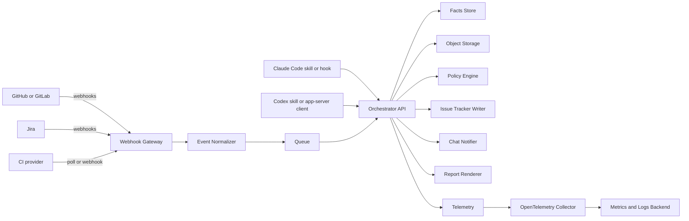
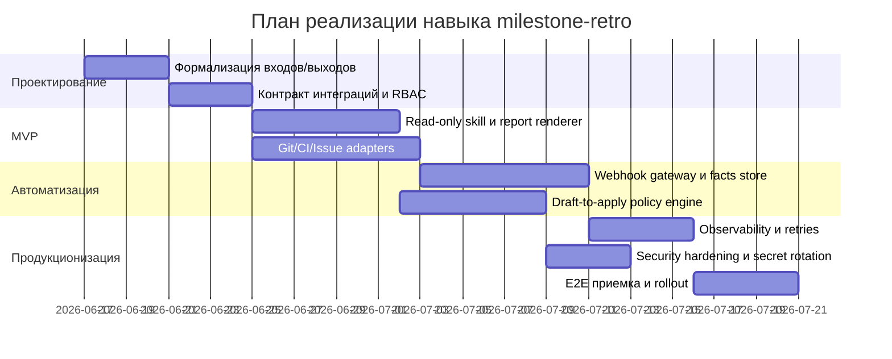

# Навык для Claude Code или Codex на основе завершённого milestone и ретроспективы

## Executive summary

Я интерпретирую `CloudCode` как **Claude Code**, а не как Google Cloud Code. Причина простая: в контексте вашего запроса фигурирует именно категория **skills/agent skills**, которая нативно документирована для Claude Code и Codex; у Google Cloud Code позиционирование и API иные — это IDE-расширение для Google Cloud, GKE и Cloud Run, а не skill-oriented agent runtime. Если эта интерпретация неверна, это ключевое допущение отчёта; в исходной постановке оно **не указано**. citeturn17search5turn7search0

Главный вывод: делать один “умный гигантский skill” невыгодно. Правильная конструкция — это **трёхслойный контур**:  
**skill как UX и orchestrator prompt**, **детерминированные hooks/webhooks для триггеров и policy**, **внешний сервис/хранилище для агрегирования артефактов milestone и выполнения post-actions**. Для Claude Code это естественно ложится на `SKILL.md` + hooks + optional plugin/MCP; для Codex — на skill + `AGENTS.md` + app-server JSON-RPC/MCP + hooks/config. Такой разрез даёт лучшую воспроизводимость, контроль прав, журналирование и повторяемость действий, чем попытка держать всё внутри одного prompt-файла. citeturn18view0turn12view3turn15view2turn16search1turn14view0

Если цель — быстро получить пользу, я бы запускал **MVP в режиме read-only**: собрать PR/MR, CI, issue tracker, retro notes и сгенерировать структурированный report + backlog follow-up actions без автоматических записей наружу. Если цель — production-grade автоматизация, следующий слой — **approved write-actions**: создание тикетов, проставление labels, публикация summary в Slack, обновление release notes, комментарии в PR/MR, фиксация owners/deadlines для retro action items. Это значительно снижает риск избыточных прав и упрощает приёмку. Claude Code прямо поддерживает skill-level `allowed-tools`, прямой user/model invocation control и HTTP hooks; Codex даёт более сильную программную поверхность через app-server (`thread/start`, `turn/start`, `skills/list`, auth/account flows, approvals). citeturn19view2turn19view3turn12view0turn14view1turn15view2

С точки зрения выбора платформы: **Claude Code сильнее как локально-детерминированный CLI-агент с богатыми lifecycle hooks**, а **Codex сильнее как программно управляемый агентный runtime с app-server, учётными режимами и формализованными thread/turn APIs**. Это не официальный вердикт вендоров, а инженерный вывод из их текущих публичных интерфейсов. citeturn0search0turn12view3turn14view0turn15view2

## Контекст и допущения

Конкретный milestone, набор репозиториев, issue tracker, CI-провайдер, стандарты релиза, формат retro и требуемые write-actions в задаче **не указаны**. Поэтому ниже я проектирую навык для типового инженерного сценария: milestone завершён, есть merged changes, CI история, issue links, release notes или draft changelog, а по итогам ретроспективы нужно превратить наблюдения в формализованные action items и закрыть повторяющиеся операционные хвосты. Это соответствует назначению Sprint Retrospective в Scrum Guide: инспектировать, как прошёл спринт относительно людей, взаимодействий, процессов, инструментов и Definition of Done, чтобы повысить качество и эффективность. citeturn10search4

Для Claude Code skill — это каталог с `SKILL.md` и, при необходимости, вспомогательными файлами; skill можно вызывать напрямую как `/skill-name`, а сам Claude может подхватывать его автоматически по описанию. При этом тело skill загружается только при использовании, что полезно для длинных чеклистов и процедур. В Claude Code пользовательские команды фактически объединены со skills. citeturn18view0turn17search5

Для Codex skill вызывается через `$skill-name`, а при программной интеграции лучше передавать отдельный `skill` item в `turn/start`, чтобы backend инжектировал полные инструкции skill явно и без лишней латентности. В экосистеме Codex репозиторию также помогает `AGENTS.md`: это открытый формат проектных инструкций с иерархией области действия и приоритетов. citeturn15view2turn16search1turn16search6

Ниже я использую термин **“навык milestone-retro”** как логический capability, который может быть реализован по-разному:
- как Claude Code skill;
- как Codex skill;
- как hybrid skill, опирающийся на внешний orchestration service;
- как skill + MCP/apps/hooks, если надо подключать внешние системы детерминированно. citeturn18view0turn15view0turn15view2

### Базовая карта возможностей Claude Code и Codex

В таблице ниже сведены только те primitives, которые прямо релевантны разработке навыка milestone/retro. Для Claude Code я опираюсь на официальные docs по skills, slash commands и hooks; для Codex — на help center, app-server README, skills APIs и AGENTS.md. citeturn18view0turn12view3turn15view2turn14view0turn3search0turn16search1

| Возможность | Claude Code | Codex | Что это значит для навыка |
|---|---|---|---|
| Skill packaging | `.claude/skills/<name>/SKILL.md` | `~/.codex/skills/<name>/SKILL.md` или project-scoped через runtime discovery | Оба варианта годятся для capability-level UX |
| Ручной вызов | `/skill-name` | `$skill-name` | Для milestone-start / retro-close команд этого достаточно |
| Автоматический вызов | По `description`/`when_to_use` | Через skill invocation и runtime discovery | Claude Code сильнее в declarative auto-discovery |
| Встроенные детерминированные hooks | Да: command/http/mcp_tool/prompt/agent hooks на множестве lifecycle events | Есть hook surfaces и trust/approval config, но центральный программный путь — app-server/config/runtime | Для policy enforcement и observability Claude Code проще стартует |
| Программный runtime API | Claude Agent SDK, slash commands/skills integration | app-server JSON-RPC с threads, turns, skills, hooks, auth, approvals | Для внешнего UI/сервиса Codex богаче |
| Репозиториальные инструкции | `CLAUDE.md` | `AGENTS.md` | В обоих случаях нужна стабильная project memory |
| Управление approvals | permissions, allow/deny rules, skill visibility and tool pre-approval | suggest/auto edit/full auto, approvals reviewer, explicit approval RPCs | Для write-actions Codex удобен при внешнем контролёре |
| Внешние системы | hooks, MCP, plugins | apps/connectors, MCP, app-server clients | Оба требуют внешний сервис для серьёзной интеграции |

## Автоматизируемые действия и триггеры

Если смотреть ретроспективно на завершённый milestone, автоматизировать надо не “мышление”, а **серии повторяемых переходов между артефактами**: PR/MR → CI → issue → changelog → retro action. Именно это даёт максимум окупаемости. Claude Code docs прямо рекомендуют skills там, где команда постоянно вставляет один и тот же многошаговый процесс, а hooks — там, где нужно детерминированное поведение, не зависящее от того, решит ли модель сделать шаг сама. citeturn18view0turn0search0turn13view1

### Подробный список повторяющихся действий и триггеров

Ниже — практический backlog автоматизации для навыка `milestone-retro`. Приоритет я даю не по “интересности”, а по отношению пользы к стоимости внедрения.

| Триггер | Повторяющееся действие | Что должен делать навык | Ценность | Сложность | Приоритет |
|---|---|---|---|---|---|
| Milestone closed | Собрать полный scope milestone | Выгрузить merged PR/MR, commits, linked issues, owners, labels, changelog entries | Очень высокая | Низкая | P0 |
| Milestone closed | Сверить план и факт | Сравнить planned issues vs shipped changes vs deferred items | Очень высокая | Средняя | P0 |
| PR/MR merged into milestone branch | Сформировать краткое change summary | Нормализовать “что сделано / почему / риск / docs impact / tests impact” | Высокая | Низкая | P0 |
| CI failed on milestone branch | Собрать контекст сбоя | Подтянуть failing jobs, flaky history, last green SHA, owner map | Очень высокая | Средняя | P0 |
| Release candidate cut | Проверить release readiness | Список open blockers, missing approvals, open incidents, missing migration/docs | Очень высокая | Средняя | P0 |
| Retro notes added | Нормализовать retro observations | Классифицировать по темам: build, review, requirements, ownership, test debt | Высокая | Низкая | P0 |
| Retro finalized | Превратить observations в action items | Создать machine-readable backlog: action, owner, due date, metric, confidence | Очень высокая | Средняя | P0 |
| Retro finalized | Проверить “actionability quality” | Отбрасывать расплывчатые выводы без owner/due date/metric | Высокая | Низкая | P0 |
| Follow-up ticket created | Связать action item с исходным событием | Проставить backlink на retro item, linked PR/MR, risk theme | Средняя | Средняя | P1 |
| Changelog draft requested | Сгенерировать release notes | Сформировать human-facing notes и internal change digest | Высокая | Низкая | P1 |
| Escaped bug after release | Связать defect с milestone | Автоматически привязать escaped defect к milestone summary и retro theme | Очень высокая | Средняя | P1 |
| Large PR/MR detected | Подсветить review anti-pattern | Отметить oversized diff, high file count, high latency review | Средняя | Низкая | P1 |
| Re-opened issue / rollback | Отразить quality signal | Увеличить risk score milestone и retro theme “quality escape” | Высокая | Средняя | P1 |
| Missing docs/tests heuristic | Создать follow-up suggestions | Предложить docs/test debt items по diff patterns | Средняя | Средняя | P1 |
| Team notification needed | Подготовить Slack/Teams summary | Короткое сообщение с shipped / missed / risks / actions | Средняя | Низкая | P1 |
| Periodic stale check | Напомнить о retro debt | Найти actions без owner, overdue, без linked PR/issue | Средняя | Низкая | P1 |
| Retro metric review | Сравнить с прошлым milestone | Lead time, CI fail rate, escaped defect count, review latency | Высокая | Средняя | P2 |
| Root-cause clustering | Кластеризовать повторы между milestone | Выявить recurrent themes across several retrospectives | Высокая | Высокая | P2 |
| Автоматическое исправление оргдолга | Самостоятельно обновить runbooks/templates/checklists | Делать только после approval | Средняя | Высокая | P2 |
| Полностью автономный write-back | Создавать/редактировать tickets/comments/labels без человека | Нужен только после зрелого approval model | Потенциально высокая | Высокая | P2 |

### Что именно стоит автоматизировать в первую очередь

Практически выгоднее всего автоматизировать следующие кластеры:

- **Сбор артефактов milestone**: это дешёвая интеграция, почти всегда read-only, и именно здесь ручной труд наиболее бессмысленен.
- **Нормализацию retro в action backlog**: команды системно производят “хорошие мысли”, но редко производят action items с owner, due date и мерой успеха.
- **Release/milestone summary**: нужен и разработчикам, и менеджменту, и support/release.
- **Anti-pattern detection**: huge PRs, long review lag, flaky CI, reopened bugs, missing docs/tests.

И наоборот, я бы не выносил в MVP:
- автономные правки в issue tracker без подтверждения;
- автоматический rerun/deploy/merge как часть навыка;
- любые destructive действия в git/CI;
- “умную” классификацию root cause без накопленной истории и gold set. Это уже второй этап. citeturn12view1turn19view2turn14view2

## Приоритизация и выбор варианта

Ключевой архитектурный выбор здесь не между “Claude Code или Codex”, а между тремя моделями исполнения.

### Сравнение вариантов реализации

| Вариант | Что внутри | Плюсы | Минусы | Когда выбирать |
|---|---|---|---|---|
| Локальный skill-only | Только `SKILL.md` + shell commands | Быстро, почти без инфраструктуры, удобен для N=1 | Слабая наблюдаемость, нет надёжной межсистемной памяти, write-actions опасны | Индивидуальный use case, MVP за несколько дней |
| Hybrid skill + service | Skill как UX, внешний сервис как orchestrator/store, webhooks/hooks для событий | Лучший компромисс: воспроизводимость, idempotency, observability, shared cache | Нужен backend и секреты | Рекомендуемый вариант |
| Централизованный service-first | Основная логика во внешнем сервисе, skill — тонкая оболочка | Легче стандартизировать на команду, сильный audit trail | Дороже, дольше, выше ops-cost | Несколько команд, compliance, production governance |

**Рекомендация:** брать **hybrid**. Claude Code skills и Codex skills хороши как человеко-ориентированный интерфейс, но не как единственное место хранения состояния milestone/retro. И Claude Code, и Codex уже подразумевают внешние интеграции через hooks/MCP/apps/app-server; значит, стратегически разумнее держать агрегированные milestone facts вне LLM context window. citeturn18view0turn12view0turn15view0turn14view0

### Приоритетная классификация по ценности и сложности

| Класс | Что входит | Почему так |
|---|---|---|
| Высокая ценность, низкая сложность | scope aggregation, summary generation, retro normalization, Slack digest | Простые чтения из API + шаблонный synthesis |
| Высокая ценность, средняя сложность | release readiness, CI failure enrichment, escaped defect linkage | Нужны 2–4 интеграции и правила консолидации |
| Средняя ценность, низкая сложность | stale reminders, checklist enforcement, oversized PR heuristics | Быстро делается, но влияние уже ниже |
| Высокая ценность, высокая сложность | cross-milestone root-cause mining, fully autonomous write-back | Требует history store, approval framework, gold datasets |
| Низкая/сомнительная ценность | “полностью автономная ретро-аналитика” без структуры | Риск галлюцинаций выше полезности |

### Выбор между Claude Code и Codex

Это уже инженерное решение по среде.

| Критерий | Лучше Claude Code | Лучше Codex |
|---|---|---|
| Нужен богатый lifecycle hook graph | Да | Скорее нет |
| Нужен HTTP hook endpoint как policy gate | Да | Частично, но не так центрально |
| Нужен внешний программный клиент/UI/rich app integration | Умеренно | Да |
| Нужны formal auth/account flows и thread/turn RPC | Ограниченно | Да |
| Команда уже живёт в Anthropic CLI и `CLAUDE.md` | Да | Нет |
| Команда хочет app/IDE/cloud convergence и Codex-native flows | Нет | Да |

Мой практический вывод такой:  
**если основная цель — автоматизировать повторяемые closeout/retro процедуры внутри terminal workflow, стартовать проще с Claude Code; если основная цель — построить командный программируемый agent backend с явным thread/turn lifecycle и внешним UI, Codex выглядит сильнее.** Это вывод по текущим surfaces, а не обещание вендоров. citeturn0search0turn12view0turn14view0turn15view2

## Техническая спецификация навыка

### Команды и интерфейсы

Я предлагаю один основной capability и три вспомогательных режима.

| Интерфейс | Команда | Назначение | Режим |
|---|---|---|---|
| Claude Code | `/milestone-retro <milestone-id>` | Полный анализ milestone + retro + draft actions | read-only / draft / apply |
| Claude Code | `/release-readiness <milestone-id>` | Проверка готовности релиза | read-only |
| Claude Code | `/retro-action-sync <milestone-id>` | Запись action items в tracker/chat | apply only |
| Codex CLI/App | `$milestone-retro ...` | Аналог `/milestone-retro` | read-only / draft / apply |
| Service API | `POST /v1/milestones/analyze` | Машинный запуск анализа | sync/async |
| Service API | `POST /v1/actions/apply` | Исполнение approved write-actions | apply |
| Webhook API | `/webhooks/github`, `/webhooks/gitlab`, `/webhooks/jira` | Инкрементальное обновление facts store | event-driven |
| Codex app-server | `turn/start` + `skill` item | Явный запуск skill из UI/бота | programmed |

### Входные данные

Ниже — минимальный payload. Всё, чего нет в постановке, помечаю как **не указано**.

```json
{
  "milestone_id": "MILESTONE-2026-06",
  "mode": "draft",
  "repos": ["org/repo-a", "org/repo-b"],
  "git_provider": "github",
  "issue_provider": "jira",
  "ci_provider": "github-actions",
  "release_tag": "v2.14.0",
  "retro_notes": {
    "type": "text",
    "value": "не указано"
  },
  "time_window": {
    "from": "2026-05-01T00:00:00Z",
    "to": "2026-05-31T23:59:59Z"
  },
  "write_targets": {
    "issue_updates": false,
    "chat_notification": true,
    "release_notes_update": false
  },
  "approval_policy": "human_required",
  "auth_profile": "default"
}
```

### Выходные данные

Выход должен быть не только human-readable, но и machine-actionable.

```json
{
  "status": "completed",
  "milestone_id": "MILESTONE-2026-06",
  "summary": {
    "shipped": 18,
    "deferred": 4,
    "blocked": 2,
    "escaped_defects": 1
  },
  "risks": [
    {
      "type": "ci_flakiness",
      "severity": "high",
      "evidence": ["workflow 8821", "test LoginSpec#raceCondition"]
    }
  ],
  "retro_themes": [
    {
      "theme": "review_latency",
      "count": 3,
      "confidence": 0.84
    }
  ],
  "actions": [
    {
      "title": "Разбить PR > 800 LOC на более мелкие изменения",
      "owner": "не указано",
      "due_date": "не указано",
      "metric": "median PR size",
      "write_ready": false
    }
  ],
  "artifacts": {
    "markdown_report_path": "s3://.../milestone-retro.md",
    "json_report_path": "s3://.../milestone-retro.json"
  }
}
```

### Состояния

| Состояние | Смысл | Переходы |
|---|---|---|
| `idle` | Нет активного анализа | `gathering` |
| `gathering` | Чтение Git/CI/issue/retro артефактов | `analyzing`, `partial_failure` |
| `analyzing` | Построение summary, risk model, action items | `draft_ready`, `failed` |
| `draft_ready` | Черновик готов, write-actions не выполнены | `awaiting_approval`, `completed` |
| `awaiting_approval` | Нужны подтверждения на внешние записи | `applying`, `cancelled` |
| `applying` | Создание/обновление тикетов, комментариев, сообщений | `completed`, `partial_failure` |
| `partial_failure` | Часть данных получена, часть действий не выполнена | `completed_with_warnings`, `retrying` |
| `completed` | Всё успешно | terminal |
| `failed` | Анализ сорван | terminal |

### Ошибки и реакция

| Код | Ситуация | Правильная реакция |
|---|---|---|
| `AUTH_MISSING` | Нет токена/логина | Не запускать write-actions; отдать инструкцию по auth |
| `AUTH_SCOPE_INSUFFICIENT` | Токен есть, scope не хватает | Выполнить read-only subset, отметить пропуски |
| `WEBHOOK_SIGNATURE_INVALID` | Поддельный/сломанный webhook | Сразу 401/403 и аудит |
| `RATE_LIMITED` | API провайдера дал 429 | Retry с backoff, idempotency key |
| `ARTIFACT_NOT_FOUND` | milestone/issue/release tag/notes не найдены | Продолжить частично и пометить gap |
| `CI_CONTEXT_TOO_LARGE` | логов слишком много | Сжать/сэмплировать, хранить raw отдельно |
| `ACTION_VALIDATION_FAILED` | action item без owner/due date/metric | Не писать наружу, вернуть в draft |
| `APPROVAL_DENIED` | Человек отклонил write-action | Сохранить draft, не повторять автоматически |
| `MODEL_CONTEXT_OVERFLOW` | контекст разросся | Использовать facts store и chunking |

### Аутентификация и права доступа

Для внешних систем нужен принцип **минимально достаточных прав**. GitHub рекомендует валидировать webhook secrets через `X-Hub-Signature-256`; Jira Cloud поддерживает admin webhooks по HTTPS и secret verification; Slack `chat.postMessage` требует scope `chat:write`. Для Codex app-server официально задокументированы режимы `apiKey` и ChatGPT-managed login; Claude Code на планах Pro/Max работает через единый account flow и делит usage limits между Claude и Claude Code. citeturn30search0turn27search1turn23search3turn14view1turn22search1

Рекомендуемый набор ролей:

| Система | Нужные права для MVP | Нужные права для apply-режима |
|---|---|---|
| GitHub | PR read, contents read, checks/status read, webhooks verify | comments write, labels/write if needed |
| GitLab | MR/API read, pipeline read, webhook receive | MR notes/write, labels/write |
| Jira | issue search/read, transitions metadata read | issue create/update/comment, transition if approved |
| Slack | не нужен для read-only | `chat:write` или incoming webhook |
| Storage | read/write own namespace | то же |
| Secret store | read runtime secrets | то же |

### Специфика для Claude Code

Claude Code skills используют YAML frontmatter, поддерживают `description`, `when_to_use`, `allowed-tools`, `disable-model-invocation`, а также запуск в изолированном `context: fork` subagent. Кроме того, project skills могут получить pre-approved tools через `allowed-tools`, но это начинает действовать только после trust workflow для project directory. HTTP hooks получают JSON POST body с `Content-Type: application/json`, а для блокировки/разрешения используют 2xx JSON response с decision fields. citeturn19view0turn19view2turn19view3turn12view0turn12view1

#### Пример `SKILL.md` для Claude Code

```md
---
name: milestone-retro
description: Анализирую завершённый milestone и ретроспективу. Использую, когда я хочу собрать shipped scope, риски, CI-проблемы, quality signals и превратить выводы ретро в action items.
when_to_use: use when the user asks for milestone summary, release readiness, retrospective synthesis, shipped vs deferred comparison, or action-item generation
allowed-tools: Read Grep Glob Bash(git status *) Bash(git log *) Bash(git diff *) Bash(jq *) Bash(node scripts/milestone-retro/export-facts.js *)
---

## Цель

Я готовлю структурированный отчёт по milestone и ретроспективе в формате:
- executive summary
- shipped / deferred / blocked
- recurring problems
- risks
- action items с owner / due date / metric
- список того, чего не хватает

## Источники

1. Сначала загрузи facts из `node scripts/milestone-retro/export-facts.js "$ARGUMENTS"`.
2. Если retro notes не найдены, явно напиши: `retro_notes: не указано`.
3. Никогда не выполняй внешние write-actions без явного режима apply.

## Критерии качества

- Не смешивай факты и интерпретации.
- Для каждого action item требуй owner, due date и metric.
- Если данных недостаточно, помечай это как `не указано`.
```

#### Пример HTTP hook-конфигурации для Claude Code

```json
{
  "hooks": {
    "PreToolUse": [
      {
        "matcher": "Bash",
        "hooks": [
          {
            "type": "http",
            "url": "http://localhost:8080/hooks/pre-tool-use",
            "timeout": 10,
            "headers": {
              "Authorization": "Bearer $MILESTONE_RETRO_TOKEN"
            },
            "allowedEnvVars": ["MILESTONE_RETRO_TOKEN"]
          }
        ]
      }
    ]
  }
}
```

#### Пример HTTP-запроса Claude Code hook → policy service

```http
POST /hooks/pre-tool-use HTTP/1.1
Content-Type: application/json
Authorization: Bearer ***redacted***

{
  "session_id": "abc123",
  "cwd": "/repo",
  "hook_event_name": "PreToolUse",
  "tool_name": "Bash",
  "tool_input": {
    "command": "jira transition ISSUE-42 Done"
  }
}
```

#### Пример HTTP-ответа policy service → Claude Code

```http
HTTP/1.1 200 OK
Content-Type: application/json

{
  "hookSpecificOutput": {
    "hookEventName": "PreToolUse",
    "permissionDecision": "deny",
    "permissionDecisionReason": "Write-action denied: milestone-retro is in draft mode",
    "additionalContext": "Сначала получи явное подтверждение пользователя на режим apply."
  }
}
```

Эта схема полностью соответствует официальной модели HTTP hooks Claude Code: POST JSON body, 2xx body as hook output schema, non-2xx treated as non-blocking error. citeturn12view0turn12view1turn12view2turn13view0

### Специфика для Codex

Codex skills вызываются через `$skill-name`, а в app-server их лучше передавать через `turn/start` c input item типа `skill`. В Codex app-server доступны formal auth endpoints (`account/login/start`, `account/read`, `account/logout`), threads/turns и approvals. Для hooks у Codex есть trust state: unmanaged hooks runnable only when trusted. Для репозитория следует дополнить capability через `AGENTS.md`, чтобы правила milestone/retro жили не только в skill, но и в общей операционной памяти проекта. citeturn15view2turn14view1turn21view0turn16search1

#### Пример skill-вызова для Codex через app-server

```json
{
  "method": "turn/start",
  "id": 101,
  "params": {
    "threadId": "thread-1",
    "input": [
      {
        "type": "text",
        "text": "$milestone-retro Проанализируй milestone MILESTONE-2026-06 и подготовь retro actions в режиме draft."
      },
      {
        "type": "skill",
        "name": "milestone-retro",
        "path": "/Users/me/.codex/skills/milestone-retro/SKILL.md"
      }
    ],
    "approvalsReviewer": "user"
  }
}
```

#### Пример ответа и дальнейшего опроса навыков в Codex

```json
{
  "id": 25,
  "result": {
    "data": [
      {
        "cwd": "/Users/me/project",
        "skills": [
          {
            "name": "milestone-retro",
            "description": "Analyze a completed milestone and retrospective",
            "enabled": true
          }
        ],
        "errors": []
      }
    ]
  }
}
```

#### Фрагмент `AGENTS.md` для Codex

```md
# Milestone and retrospective rules

- For every completed milestone, produce:
  - shipped vs deferred list
  - CI failures summary
  - escaped defects summary
  - retro action items with owner, due date, success metric
- Never apply external updates unless the user explicitly requests apply mode.
- If retro notes are missing, say "не указано".
- Prefer linked issues and merged PR/MR facts over inferred summaries.
```

## Архитектура и интеграции

### Рекомендуемая архитектура

Для production-quality навыка я рекомендую следующую схему: skill в агенте только инициирует и объясняет процедуру, а **факты, интеграции, retries, idempotency и audit trail** живут во внешнем сервисе. GitHub и GitLab умеют присылать webhook events для pull/merge activity; Jira Cloud умеет webhooks по HTTPS с retries и secret validation; Slack принимает либо incoming webhooks, либо `chat.postMessage`; Codex app-server и Claude Code hooks позволяют подцепить агентный runtime к этому сервису. Для observability лучше сразу закладывать traces/metrics/logs через OpenTelemetry и аварийные нотификации через Prometheus Alertmanager. citeturn25search0turn29search1turn27search1turn23search1turn23search3turn28search1turn28search5turn28search0



### Необходимые API и интеграции

| Домены интеграции | Минимум для MVP | Для production |
|---|---|---|
| Git provider | PR/MR list, commits, changed files, reviews, statuses/checks | webhooks, compare endpoints, comments/labels write |
| CI | workflow/job status read | flaky history, rerun metadata, pipeline annotations |
| Issue tracker | search/read | create/update/comment/transition |
| Chat | необязательно | Slack/Teams posting |
| Storage | SQLite or local files | PostgreSQL + object storage |
| Queue | необязательно | Redis/SQS/NATS/Kafka class |
| Observability | stdout logs | OTel + Prometheus/Alertmanager |
| Secrets | env vars | Secret Manager/Vault/KMS-backed |

### Сравнение хранилищ

Если use case одиночный и write-intensity мала, можно стартовать с SQLite в WAL mode. SQLite документирует WAL как режим, в котором readers и writer меньше блокируют друг друга, но это всё равно не база для серьёзной многопоточности и распределённого worker pool. Для команды или server-backed режима правильнее брать PostgreSQL. citeturn28search3

| Хранилище | Плюсы | Минусы | Рекомендация |
|---|---|---|---|
| SQLite WAL | Почти нулевая ops-стоимость, быстро для локального MVP | Ограничения конкурентной записи, неудобен для shared service | Только MVP / single-user |
| PostgreSQL | Нормальная транзакционность, shared service, индексы, JSONB | Нужен managed instance или ops | Рекомендуемый baseline |
| Object storage | Дёшево хранить raw reports/log chunks | Не заменяет relational facts store | Обязательно как архив сырья |

### Вебхуки, retries и idempotency

Это критическая часть, и её часто недооценивают. GitHub прямо рекомендует валидировать webhook secret и проверять `X-Hub-Signature-256`; GitLab webhooks временно отключаются после серии неудачных доставок и могут быть permanently disabled после длительной неуспешности; Jira Cloud имеет retry policy и разный delivery flow для `Primary` и `Secondary` webhooks. Следствие: ваш receiver обязан быть **идемпотентным**, быстро подтверждать приём, журналировать raw payload и выносить тяжёлую обработку в очередь/async worker. citeturn30search0turn29search3turn27search1

### CI/CD и развёртывание

Если проект на GitHub, удобно развернуть service через GitHub Actions и завести GitHub App/Webhooks для read/write paths. Если проект на GitLab, полезно использовать MR pipelines и webhook events project/group level. Для Codex-ориентированной команды можно сделать тонкий internal frontend поверх `codex app-server`; для Claude Code — держать сервис независимым и подключать skill/hooks локально или через team-wide config/plugin. citeturn24search0turn25search0turn23search0turn29search0turn29search1

## План реализации, тестирование и стоимость

### План реализации по этапам

Ниже — реалистичный, а не “маркетинговый” план. Я исхожу из hybrid architecture.



### Этапы, время и риски

| Этап | Содержание | Оценка времени | Главные риски |
|---|---|---:|---|
| Discovery | Нормализовать milestone inputs, retro schema, write policies | 1 неделя | Размытые требования, “не указано” по источникам |
| MVP read-only | Skill + report + adapters read path | 1.5–2 недели | Недооценка data mapping |
| Event-driven layer | Webhooks, queue, facts store | 1.5–2 недели | Duplicate events, missing signatures |
| Apply-mode | Approval flow, issue/chat write-backs | 1–1.5 недели | Over-privileged tokens, плохая UX approval |
| Hardening | Observability, retries, error budgets, docs | 1–1.5 недели | Hidden rate limits, noisy alerts |
| Acceptance rollout | Pilot on 1–2 milestone cycles | 1 неделя | Prompt drift, team adoption |

**Итого:**  
- **MVP:** 2.5–4 недели  
- **Production-ready v1:** 6–8 недель  
- **Если нужна multi-team governance с полноценным portal/UI:** 8–12 недель

### Основные риски и меры снижения

| Риск | Вероятность | Влияние | Как резать |
|---|---:|---:|---|
| Галлюцинации по retro root cause | Средняя | Высокое | Жёстко разделять facts и interpretation; хранить source links |
| Дублирование write-actions | Высокая | Высокое | Idempotency keys, action hash, outbox table |
| Недостаточные scopes | Высокая | Среднее | Начинать с read-only и incremental scope enablement |
| Слишком широкий доступ skill к инструментам | Средняя | Высокое | deny-by-default, explicit apply mode, approvals |
| API rate limits | Средняя | Среднее | Backoff, caching, async queue, incremental refresh |
| Некачественные retro notes | Высокая | Среднее | Валидатор качества action items + “не указано” fallback |
| Нестабильные hooks и доверие к ним | Средняя | Среднее | Trust workflow, managed config, audit trail |
| Перегрузка контекста модели | Средняя | Среднее | Facts store, chunking, summary cache |

### Тестовый план

Тестировать надо не только “выдал ли красивый текст”, а **конечную воспроизводимость workflow**.

#### Функциональные тесты

| Слой | Что проверять |
|---|---|
| Parsing/normalization | milestone inputs, issue links, CI records, retro note extraction |
| Report synthesis | структура отчёта, наличие обязательных секций, корректное число action items |
| Action validator | owner/due date/metric mandatory rules |
| Policy engine | read-only запрещает write-actions; apply mode требует approval |
| Adapter layer | GitHub/GitLab/Jira/Slack happy paths и degraded paths |
| Idempotency | повторный запуск не дублирует комментарии/тикеты |
| Partial failure | отсутствие одного источника не валит весь отчёт |

#### Интеграционные тесты

Нужно закрыть такие сценарии:
- webhook signature valid/invalid;
- duplicate webhook delivery;
- upstream `429` и `5xx`;
- missing issue permissions;
- Slack post failure;
- reconnect/retry;
- Codex `account/login/start` и Claude account-bound flows в smoke-режиме;
- trust/enable/disable hooks, если используете hook-driven policy. citeturn30search0turn27search1turn23search3turn14view1turn21view0

#### Нефункциональные тесты

| Категория | Цель |
|---|---|
| Надёжность | Повторная доставка webhooks не ломает состояние |
| Производительность | p95 read-only analysis < 2 мин на одном milestone среднего размера |
| Безопасность | Все inbound webhooks отклоняются без валидной подписи |
| Наблюдаемость | У каждого анализа есть trace id, run id, artifact ids |
| Управление секретами | Нет секретов в skill repo, логах и rendered reports |
| Регрессия prompt logic | Golden dataset из 5–10 реальных milestone/retro кейсов |

### Критерии приёмки

Ниже — строгие, измеримые criteria для `v1`:

1. Я могу запустить `milestone-retro` в режиме `draft` и получить:
   - executive summary,
   - shipped/deferred/blocked,
   - список recurring themes,
   - action items с валидацией обязательных полей,
   - перечень missing inputs как `не указано`.

2. Повторный запуск на том же milestone не создаёт дубликаты внешних записей.

3. Если отсутствуют retro notes, функция не падает и явно помечает недостаток данных.

4. Все write-actions требуют либо:
   - явного `apply`,
   - либо policy-approved path с audit trail.

5. Любой inbound webhook без валидной подписи отвергается.

6. При сбое отдельного провайдера итог имеет статус `completed_with_warnings`, а не silent failure.

7. Все отчёты доступны и в Markdown, и в JSON.

### Шаблоны сообщений и UX

Поскольку вы просили first-person voice, ниже — шаблоны именно от первого лица.

#### Старт анализа

```text
Я начинаю анализ milestone {milestone_id} в режиме {mode}.
Я соберу shipped scope, deferred items, CI-сигналы, quality risks и выводы ретроспективы.
Если каких-то данных нет, я помечу их как «не указано».
```

#### Когда не хватает данных

```text
Я не нашёл следующие обязательные или желательные данные:
- retro notes: не указано
- release tag: не указано

Я продолжу анализ по доступным артефактам, но уверенность в action items будет ниже.
```

#### Запрос на подтверждение write-actions

```text
Я подготовил {n} внешних изменений:
- {x} тикетов к созданию
- {y} комментариев к публикации
- {z} уведомлений в чат

Сейчас я в режиме draft и ничего не записываю наружу.
Если нужно, подтвердите apply-режим.
```

#### Завершение

```text
Я завершил анализ milestone {milestone_id}.
Главное:
- shipped: {n}
- deferred: {n}
- blocker themes: {list}
- action items ready: {n}
- missing inputs: {list or none}
```

#### Короткий Slack digest

```text
Я завершил разбор milestone {milestone_id}.

Что выпущено: {short shipped summary}
Что не вошло: {short deferred summary}
Главные риски: {risk_1}, {risk_2}
Action items: {n}, owners assigned: {m}/{n}

Полный отчёт: {link}
```

### Зависимости и альтернативы

| Компонент | Основной выбор | Альтернатива | Комментарий |
|---|---|---|---|
| Agent UX | Claude Code skill / Codex skill | Только сервис без skill | Потеря удобства для инженеров |
| Project memory | `CLAUDE.md` / `AGENTS.md` | README-only | Слабее operational discipline |
| Trigger layer | GitHub/GitLab/Jira webhooks | Polling | Polling проще, но хуже по latency и cost |
| Storage | PostgreSQL + object storage | SQLite WAL + files | Только для MVP |
| Queue | Redis/SQS/NATS class | inline async jobs | Inline годится лишь при малой нагрузке |
| Observability | OpenTelemetry + Prometheus/Alertmanager | vendor-specific APM | Vendor-neutral стек проще переносить |
| Chat | Slack `chat.postMessage` | incoming webhook | Web API гибче и лучше для RBAC |
| Approval model | human-in-the-loop | full auto | full auto только после зрелой телеметрии |

### Оценка человеческих и инфраструктурных ресурсов

#### Команда

| Роль | Нагрузка | Срок |
|---|---:|---:|
| Senior backend/platform engineer | 1.0 FTE | 6–8 недель |
| Второй engineer/integrations | 0.5–1.0 FTE | 4–6 недель |
| QA/SDET | 0.3–0.5 FTE | 2–3 недели |
| Product/engineering manager | 0.2–0.3 FTE | весь цикл |
| Security/platform reviewer | 0.1 FTE | точечно |

Минимально реалистичный состав на production v1 — **1.5–2.0 инженерных FTE** плюс частичное участие QA и security.

#### Инфраструктура

| Профиль | Оценка в месяц | Что входит |
|---|---:|---|
| Local MVP | $0–20 | Локальный runtime, файлы, SQLite, без shared service |
| Small hybrid | $50–200 | 1 small app instance, managed DB начального уровня, object storage |
| Team production | $250–900 | 2 app instances, managed Postgres, queue, dashboards, backups |
| Hardened production | $900–2000+ | HA, multi-env, secrets manager, centralized observability |

Это **инженерная оценка**, а не прайс-лист конкретного облака.

#### Стоимость моделей

Если использовать **Codex через API**, модель `GPT-5.2-Codex` на момент текущей документации публикуется по цене **$1.75 / 1M input tokens** и **$14 / 1M output tokens**. Тогда прогон на 30k input + 8k output стоит примерно **$0.1645**; 200 таких прогонов в месяц — около **$32.9** без учёта tool-call overhead и без caching economics. citeturn3search2

Если использовать **Claude API Sonnet 4.6**, цена начинается с **$3 / 1M input tokens** и **$15 / 1M output tokens**. Тот же прогон 30k input + 8k output даёт примерно **$0.21**; 200 прогонов — около **$42**. Если же использовать **Claude Code по подписке**, модель расходует общий лимит плана Pro/Max, а не отдельный per-token invoice: Pro — $20/месяц, Max 5x — $100, Max 20x — $200, с общими лимитами для Claude и Claude Code. citeturn22search3turn22search1

## Итоговая рекомендация

Если бы я делал это без дополнительных уточнений, я бы выбрал такой путь:

1. **Сначала — hybrid MVP в read-only режиме.**  
   Skill только запускает и объясняет процедуру; внешний сервис агрегирует факты milestone и retro.

2. **Для Claude Code** я бы сделал:
   - `.claude/skills/milestone-retro/SKILL.md`,
   - `CLAUDE.md` с проектными правилами,
   - HTTP hook policy layer только для запрета опасных write-actions вне apply-режима. citeturn18view0turn12view0

3. **Для Codex** я бы сделал:
   - `~/.codex/skills/milestone-retro/SKILL.md`,
   - `AGENTS.md`,
   - app-server client или thin UI, который вызывает `turn/start` со skill item и отдельно управляет approvals/auth. citeturn15view2turn14view1turn16search1

4. **В приоритете P0** я бы реализовал только:
   - scope aggregation,
   - CI/risk enrichment,
   - retro normalization,
   - action item validation,
   - markdown + JSON report,
   - Slack digest.

5. **Всё, что пишет наружу**, я бы держал за явным approval gate до тех пор, пока:
   - не появится idempotency,
   - не будет gold dataset,
   - не накопится телеметрия по false positives/false actions.

Это даст навык, который реально снижает рутину после milestone, а не просто создаёт еще один “умный prompt-файл”. citeturn13view1turn19view2turn14view2turn21view0